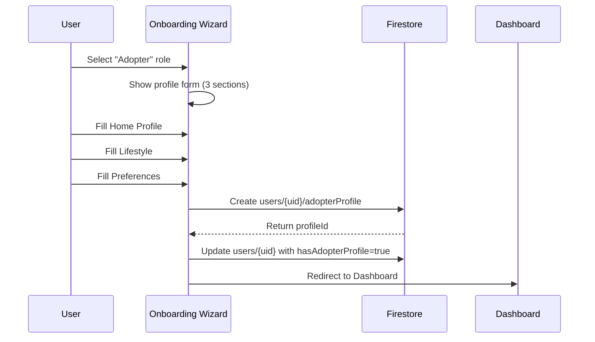
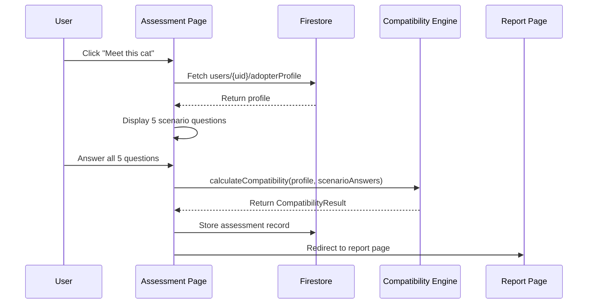
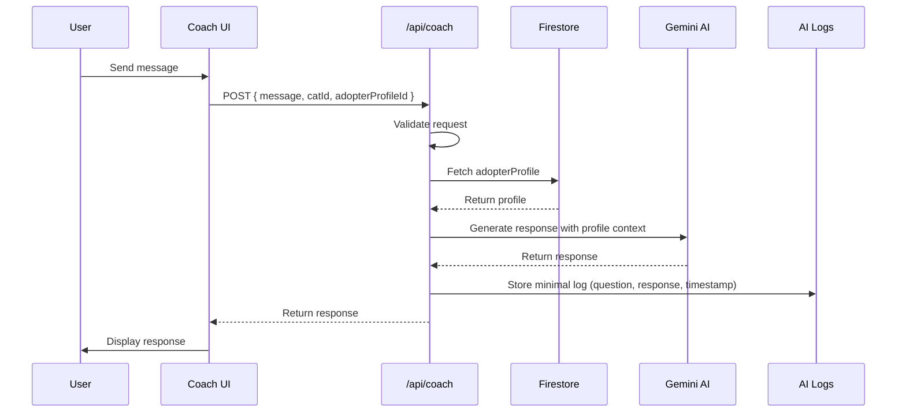
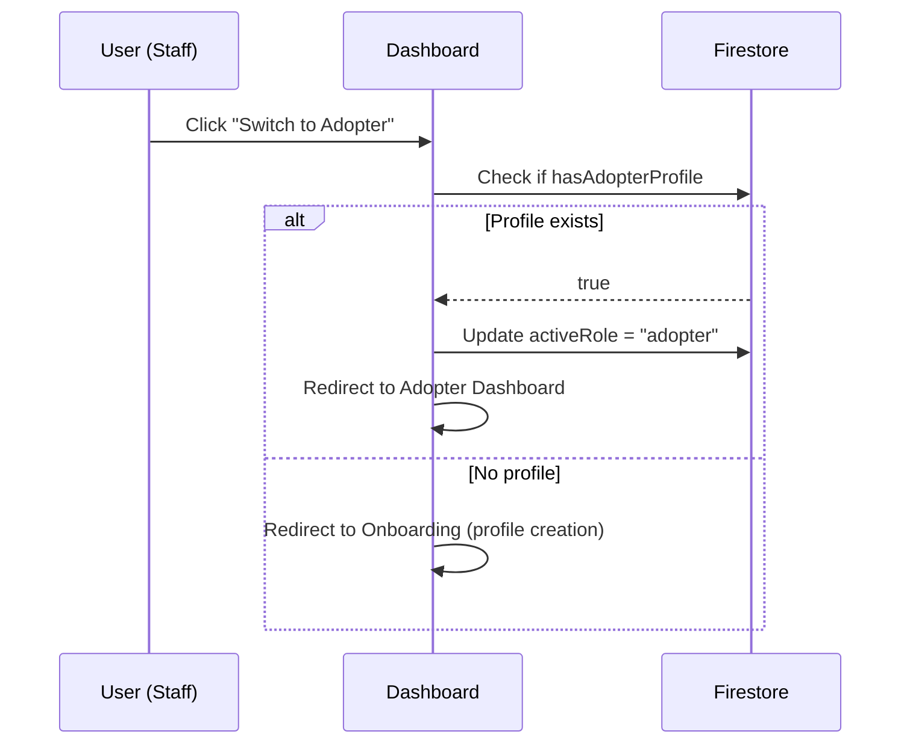

# Design Document: ForeverHome Architecture V2 Refactoring

## Overview

This refactoring introduces a stateless AI architecture where Firebase serves as the source of truth. The adopter profile becomes a permanent, editable entity stored in Firestore, separate from the assessment flow. The assessment is simplified to 5 scenario-based questions since profile information is already known. Shelter staff can toggle between roles, enabling them to also be adopters. AI logging is minimal, storing only essential metadata.

## Architecture

```mermaid
graph TD
    subgraph Client
        A[Onboarding Wizard] --> B[Adopter Profile Store]
        C[Assessment Page] --> D[Scenario Questions Only]
        E[Dashboard] --> F[Profile Editor]
        G[Shelter Dashboard] --> H[Role Toggle]
    end

    subgraph Firestore
        B --> I[users/{uid}/adopterProfile]
        D --> J[assessments/{assessmentId}]
        K[AI Logs] --> L[aiLogs/{logId}]
    end

    subgraph API Layer
        M[/api/coach] --> N[Fetch Profile from Firestore]
        N --> O[Generate AI Response]
        O --> P[Log Minimal Metadata]
    end

    I --> N
```

## Components and Interfaces

### Component 1: AdopterProfile (Data Model)

**Purpose**: Stores complete adopter information as a permanent, editable profile in Firestore.

**Firestore Path**: `users/{uid}/adopterProfile`

**Interface**:
```typescript
interface AdopterProfile {
  // Basic Information
  id: string;                    // Auto-generated or user UID
  uid: string;                   // Reference to user document
  name: string;                  // Display name
  profilePhoto: string | null;   // Optional profile photo URL
  email: string;                 // Contact email
  phone: string | null;          // Optional phone number
  
  // Home Profile
  homeType: "apartment" | "house" | "condo" | "other";
  hasChildren: boolean;
  childrenAges: string[];        // Array of age ranges: ["0-4", "5-9", "10-14", "15+"]
  hasExistingPets: boolean;
  existingPets: {
    cats: number;
    dogs: number;
    other: string[];             // Descriptions of other pets
  };
  hasGarden: boolean;
  indoorOnlyPreference: boolean; // Preference for indoor-only cats
  
  // Lifestyle
  workHours: "home-most-day" | "out-part-day" | "out-most-day" | "varies";
  travelFrequency: "rarely" | "occasional" | "frequent";
  householdNoise: "quiet" | "moderate" | "active";
  catExperience: "none" | "beginner" | "intermediate" | "experienced";
  
  // Preferences
  personalityPreference: ("calm" | "playful" | "independent" | "affectionate")[];
  agePreference: ("kitten" | "adult" | "senior")[];
  specialNeedsOpenness: boolean;
  
  // Metadata
  createdAt: Timestamp;
  updatedAt: Timestamp;
  isComplete: boolean;           // Whether all required fields are filled
}
```

**Validation Rules**:
- `name` is required and must be non-empty
- `email` must be a valid email format
- `homeType` must be one of the defined values
- `childrenAges` can only contain valid age range strings
- `existingPets.cats` and `existingPets.dogs` must be non-negative integers
- `catExperience` must be one of the defined values

### Component 2: Assessment (Simplified)

**Purpose**: Conducts scenario-based assessment using known profile data.

**Interface**:
```typescript
interface AssessmentSession {
  id: string;
  catId: string;
  adopterProfileId: string;      // Reference to the profile
  scenarioAnswers: {
    questionId: string;
    answer: string;
  }[];
  compatibilityScore: number;
  recommendation: "excellent" | "good" | "fair" | "not-recommended";
  createdAt: Timestamp;
  completedAt: Timestamp | null;
}

interface ScenarioQuestion {
  id: string;
  scenario: string;              // The scenario text
  options: {
    value: string;
    label: string;
    score: number;               // For compatibility calculation
  }[];
  traits: string[];              // Which traits this question assesses
}
```

**Responsibilities**:
- Display exactly 5 scenario-based questions
- Receive adopter profile from Firestore (not from form input)
- Calculate compatibility based on scenario answers + known profile
- Store assessment results separately from profile

### Component 3: Role System

**Purpose**: Enables users to have multiple roles with simple toggle functionality.

**Interface**:
```typescript
interface UserRole {
  uid: string;
  primaryRole: "adopter" | "shelter_staff";
  roles: ("adopter" | "shelter_staff")[];
  activeRole: "adopter" | "shelter_staff";  // Current active role
  shelterId: string | null;
  shelterRole: "admin" | "staff" | null;
}
```

**Responsibilities**:
- Support multiple roles per user
- Provide role toggle in UI
- Maintain separate state per role

### Component 4: AI Coach API

**Purpose**: Stateless AI endpoint that fetches profile from Firestore.

**Interface**:
```typescript
// Request
interface CoachRequest {
  message: string;
  catId: string;
  adopterProfileId: string;      // Required - AI fetches profile from Firestore
  context?: {
    currentDay?: number;
    recentCheckIns?: CheckIn[];
  };
}

// Response
interface CoachResponse {
  response: string;
  isEmergency: boolean;
  source: "gemini" | "fallback";
  disclaimer?: string;
}
```

**Responsibilities**:
- Validate `adopterProfileId` is provided
- Fetch profile from Firestore
- Generate AI response with profile context
- Log minimal metadata (question, response, timestamp only)

### Component 5: AI Logging

**Purpose**: Minimal logging of AI interactions for debugging and analytics.

**Interface**:
```typescript
interface AILog {
  id: string;
  uid: string;                   // User ID
  catId: string;                 // Cat being discussed
  question: string;              // User's question
  response: string;              // AI response
  timestamp: Timestamp;
  source: "gemini" | "fallback";
  // Note: No full context stored
}
```

**Firestore Path**: `aiLogs/{logId}`

**Responsibilities**:
- Store only question, response, and timestamp
- No storage of full conversation context
- Enable basic analytics and debugging

## Data Models

### User Document (Updated)

```typescript
interface UserDocument {
  uid: string;
  email: string;
  displayName: string;
  roles: ("adopter" | "shelter_staff")[];  // Changed from single role
  activeRole: "adopter" | "shelter_staff"; // Current active role
  photoURL: string | null;
  createdAt: Timestamp;
  onboardingComplete: boolean;
  shelterId: string | null;
  
  // Profile references (not embedded)
  hasAdopterProfile: boolean;    // Flag indicating profile exists
  staffProfile: StaffProfile | null;
}
```

### AdopterProfile Collection

**Collection**: `users/{uid}/adopterProfile` (subcollection)

See Component 1 for full interface.

### Assessment Collection

**Collection**: `assessments`

```typescript
interface AssessmentRecord {
  id: string;
  adopterUid: string;
  catId: string;
  adopterProfileId: string;      // Reference to profile at time of assessment
  scenarioAnswers: ScenarioAnswer[];
  compatibilityResult: CompatibilityResult;
  createdAt: Timestamp;
  expiresAt: Timestamp;          // Auto-expire after 30 days
}
```

## Sequence Diagrams

### Onboarding Flow (New Adopter)



### Assessment Flow (Simplified)



### AI Coach Flow (Stateless)



### Role Toggle Flow



## Error Handling

### Error Scenario 1: Missing Adopter Profile

**Condition**: Assessment requested but no profile exists
**Response**: Redirect to onboarding with message "Please complete your profile first"
**Recovery**: User completes profile, then returns to assessment

### Error Scenario 2: Invalid Profile ID in Coach Request

**Condition**: API receives non-existent `adopterProfileId`
**Response**: Return 400 error with message "Invalid profile reference"
**Recovery**: Client re-fetches valid profile ID from Firestore

### Error Scenario 3: Profile Fetch Failure

**Condition**: Firestore unavailable during profile fetch
**Response**: Use cached profile if available, otherwise show error
**Recovery**: Retry with exponential backoff, inform user of connectivity issues

### Error Scenario 4: Assessment Incomplete

**Condition**: User leaves assessment mid-way
**Response**: Auto-save progress to sessionStorage
**Recovery**: Resume from last answered question on return

## Testing Strategy

### Unit Testing Approach

- Test profile validation functions with edge cases
- Test compatibility calculation with various profile/question combinations
- Test role toggle logic
- Test AI request validation
- Use React Testing Library for component tests

### Property-Based Testing Approach

**Property Test Library**: fast-check (already in devDependencies)

**Properties to Test**:
1. Profile serialization/deserialization round-trip
2. Compatibility score is always within bounds (0-100)
3. Scenario answer mapping preserves data integrity
4. Role toggle preserves existing roles

### Integration Testing Approach

- Test Firestore CRUD operations for profiles
- Test API endpoint with mock Firestore
- Test full assessment flow from profile fetch to result storage
- Test AI coach with profile context injection

## Security Considerations

### Firestore Security Rules

```javascript
rules_version = '2';
service cloud.firestore {
  match /databases/{database}/documents {
    // Users can only read/write their own profile
    match /users/{userId}/adopterProfile/{profileId} {
      allow read, write: if request.auth.uid == userId;
    }
    
    // Assessments are user-specific
    match /assessments/{assessmentId} {
      allow read: if request.auth.uid == resource.data.adopterUid;
      allow create: if request.auth.uid == request.resource.data.adopterUid;
    }
    
    // AI logs are write-only for users, read for analytics
    match /aiLogs/{logId} {
      allow create: if request.auth != null;
      allow read: if hasRole('analytics');  // Hypothetical admin role
    }
  }
}
```

### API Security

- Validate `adopterProfileId` belongs to authenticated user
- Rate limit AI coach endpoint
- Sanitize all user inputs before AI processing
- Never expose full profile context in client-side code

## Dependencies

### Existing Dependencies (No Changes Required)
- `firebase` (v12.15.0) - Firestore operations
- `next` (v16.2.9) - API routes and pages
- `zod` (v4.4.3) - Schema validation
- `fast-check` (v4.8.0) - Property-based testing

### No New Dependencies Required
The refactoring uses existing infrastructure and libraries. All changes are architectural and structural.

## Correctness Properties

*A property is a characteristic or behavior that should hold true across all valid executions of a system-essentially, a formal statement about what the system should do. Properties serve as the bridge between human-readable specifications and machine-verifiable correctness guarantees.*

### Property 1: Profile Round-Trip Consistency

*For any* valid AdopterProfile, saving to Firestore and then fetching SHALL produce an equivalent profile with all fields preserved.

**Validates: Requirements 1.3**

### Property 2: Required Field Validation

*For any* AdopterProfile missing a required field (name, email, homeType, catExperience), validation SHALL fail and the profile SHALL NOT be saved.

**Validates: Requirements 1.4**

### Property 3: Profile Completeness Calculation

*For any* AdopterProfile with all required fields populated, the `isComplete` field SHALL be true.

**Validates: Requirements 1.5**

### Property 4: Invalid Profile ID Rejection

*For any* invalid `adopterProfileId` (empty, null, or non-existent), the AI coach endpoint SHALL return a 400 error.

**Validates: Requirements 2.3**

### Property 5: Minimal AI Log Structure

*For any* AI interaction, the log entry SHALL contain exactly the fields: uid, catId, question, response, timestamp, source, and no other fields.

**Validates: Requirements 7.1**

### Property 6: Scenario Questions Only

*For any* assessment, all displayed questions SHALL be of type "scenario" with no lifestyle or home profile questions.

**Validates: Requirements 4.4**

### Property 7: Compatibility Score Bounds

*For any* combination of AdopterProfile and scenario answers, the calculated compatibility score SHALL be a number between 0 and 100 (inclusive).

**Validates: Requirements 9.1**

### Property 8: Valid Recommendation Assignment

*For any* calculated compatibility score, the assigned recommendation SHALL be exactly one of: "excellent", "good", "fair", or "not-recommended".

**Validates: Requirements 9.3**

### Property 9: Roles Array Preservation

*For any* user roles array, saving and fetching the user document SHALL preserve the roles array exactly.

**Validates: Requirements 5.5**

### Property 10: Form Field Capture

*For any* valid form submission from the onboarding wizard, all filled fields SHALL be present in the submitted profile data.

**Validates: Requirements 6.2, 6.3, 6.4**

### Property 11: Optional Fields Handling

*For any* AdopterProfile with optional fields (profilePhoto, phone) omitted, the profile SHALL still be valid and savable.

**Validates: Requirements 6.6**

### Property 12: Update Timestamp Monotonicity

*For any* profile update operation, the `updatedAt` timestamp SHALL be greater than the previous `updatedAt` value.

**Validates: Requirements 8.3**

### Property 13: Assessment Profile Reference

*For any* completed assessment, the assessment record SHALL include a valid reference to the AdopterProfile used for calculation.

**Validates: Requirements 9.5**

### Property 14: Unauthorized Profile Access Rejection

*For any* API request referencing a profile that does not belong to the authenticated user, the system SHALL reject the request with an authorization error.

**Validates: Requirements 10.4**

### Property 15: Validation Rule Consistency

*For any* invalid profile data, validation SHALL fail with equivalent errors whether the operation is creation or update.

**Validates: Requirements 8.5**

## Migration Considerations

### Data Migration

1. Create `adopterProfile` subcollections for existing users
2. Migrate embedded profile data from `users/{uid}` to `users/{uid}/adopterProfile`
3. Update `roles` field from single value to array
4. Add `activeRole` field to existing users

### Backward Compatibility

- Support both old and new profile formats during transition
- Old assessments should still reference valid profiles
- API should handle requests with and without `adopterProfileId` during migration
