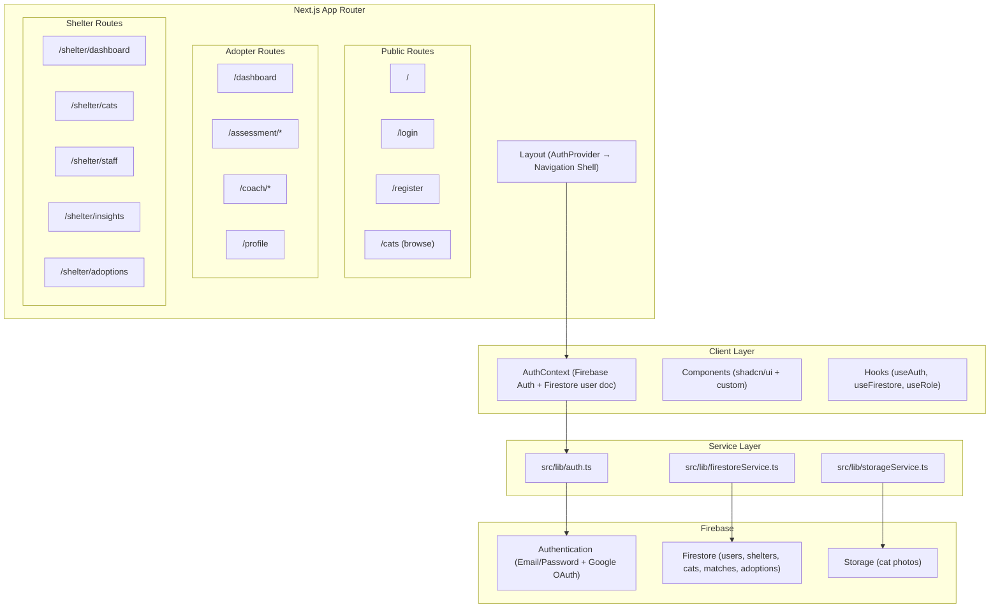
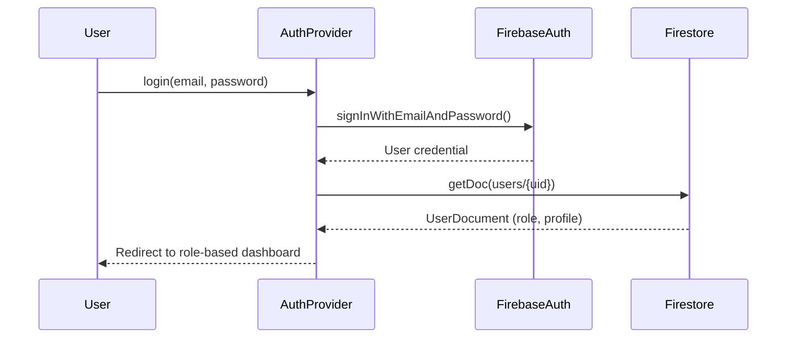

# Design Document: Production UI/UX

## Overview

This design transforms ForeverHome AI from a hackathon demo into a production-ready application with Firebase Authentication, role-based user profiles, shelter management, cat CRUD, proper branding, and polished UI/UX. The architecture preserves the existing demo flow while layering authentication, Firestore persistence, and role-based navigation on top.

The application serves two distinct user types — Shelter Staff (who manage cat profiles, monitor adoptions, and view shelter insights) and Adopters (who browse cats, complete assessments, use the 14-Day Coach, and log daily check-ins). The design introduces a Navigation Shell with role-aware routing, a production-quality Design Palette, skeleton loading states, error boundaries, and responsive layouts from 320px to 1920px.

## Architecture

### High-Level Architecture



### Authentication Flow



### Route Structure

| Route | Access | Purpose |
|-------|--------|---------|
| `/` | Public | Landing page |
| `/login` | Public | Login form |
| `/register` | Public | Registration with role selection |
| `/onboarding` | Authenticated (incomplete) | Post-registration guided setup |
| `/cats` | Public (browse) | Available cats listing |
| `/assessment/[catId]` | Adopter | Adopter questionnaire |
| `/report/[matchId]` | Adopter | Compatibility report |
| `/coach/[adoptionId]` | Adopter | 14-Day Coach |
| `/dashboard` | Adopter | Adopter's home (my assessments, adoptions) |
| `/profile` | Authenticated | Edit profile |
| `/shelter/dashboard` | Shelter_Staff | Shelter overview |
| `/shelter/cats` | Shelter_Staff | Cat management list |
| `/shelter/cats/new` | Shelter_Staff | Add new cat |
| `/shelter/cats/[id]/edit` | Shelter_Staff | Edit cat |
| `/shelter/staff` | Shelter_Admin | Staff management |
| `/shelter/insights` | Shelter_Staff | Shelter insights |
| `/shelter/adoptions` | Shelter_Staff | Monitor active adoptions |
| `/outcome` | Public | With/without ForeverHome story |

## Components and Interfaces

### 1. AuthProvider (Context)

```typescript
// src/contexts/AuthContext.tsx
interface AuthContextValue {
  user: User | null;              // Firebase Auth user
  userDoc: UserDocument | null;   // Firestore user document
  role: "adopter" | "shelter_staff" | null;
  loading: boolean;
  login: (email: string, password: string) => Promise<void>;
  loginWithGoogle: () => Promise<void>;
  register: (email: string, password: string, role: string) => Promise<void>;
  logout: () => Promise<void>;
}
```

The provider wraps the entire app in `layout.tsx`. It listens to `onAuthStateChanged` and fetches the Firestore user document to resolve roles. Loading state prevents flash of unauthenticated content.

### 2. AuthGuard Component

```typescript
// src/components/auth/AuthGuard.tsx
interface AuthGuardProps {
  children: React.ReactNode;
  requiredRole?: "adopter" | "shelter_staff";
  fallbackPath?: string;
}
```

Wraps protected page layouts. Checks auth state and role from context. Redirects to `/login?redirect={currentPath}` if unauthenticated.

### 3. Navigation Shell

```typescript
// src/components/layout/NavigationShell.tsx
interface NavigationShellProps {
  children: React.ReactNode;
}
```

The Navigation Shell replaces the existing `Header` component with a role-aware layout:

- **Unauthenticated**: Simple top header with logo, "Browse Cats", Login, Register
- **Adopter**: Top header with logo + nav links (Home, Cats, My Assessments, Coach, Profile) + avatar dropdown
- **Shelter Staff**: Sidebar layout on desktop (collapsible) with: Dashboard, Cat Management, Adoptions, Insights, Staff, Profile. On mobile: hamburger menu with the same items.

### 4. Cat Form Component

```typescript
// src/components/shelter/CatForm.tsx
interface CatFormProps {
  initialData?: Cat;
  onSubmit: (cat: Omit<Cat, 'id'>) => Promise<void>;
  isEditing?: boolean;
}
```

Multi-section form with:
- Basic info (name, age, sex, life stage, neutered status)
- Photo upload (to Firebase Storage, with preview and crop)
- Behavioral traits (dropdowns/selects for each CatBehavior field)
- Care needs (text inputs for medical, medication, FIV, notes)
- Status selector

### 5. Skeleton Components

```typescript
// src/components/ui/skeleton.tsx
<Skeleton className="h-4 w-full" />      // text line
<Skeleton className="h-32 w-full" />     // card
<Skeleton className="h-10 w-10 rounded-full" /> // avatar
```

Page-level skeleton compositions:
- `CatListSkeleton` — grid of card-shaped skeletons
- `DashboardSkeleton` — summary cards + activity feed
- `ProfileSkeleton` — avatar + form fields

### 6. Error Boundary

```typescript
// src/components/error/ErrorBoundary.tsx
interface ErrorBoundaryProps {
  children: React.ReactNode;
  fallback?: React.ReactNode;
}
```

Catches React rendering errors, displays friendly UI with:
- ForeverHome AI illustration
- "Something went wrong" message
- "Go Home" and "Try Again" buttons
- Error logged to console (production: error reporting service)

### 7. Service Layer Interfaces

```typescript
// src/lib/auth.ts
export function loginWithEmail(email: string, password: string): Promise<UserCredential>;
export function loginWithGoogle(): Promise<UserCredential>;
export function registerUser(email: string, password: string, role: string): Promise<UserCredential>;
export function logoutUser(): Promise<void>;
export function resolveUserRole(uid: string): Promise<UserDocument>;

// src/lib/firestoreService.ts (extended)
export function createUserDocument(uid: string, data: Partial<UserDocument>): Promise<void>;
export function getUserDocument(uid: string): Promise<UserDocument | null>;
export function updateUserProfile(uid: string, profile: Partial<UserDocument>): Promise<void>;
export function createShelter(data: ShelterData, adminUid: string): Promise<string>;
export function getShelterCats(shelterId: string): Promise<Cat[]>;
export function createCat(shelterId: string, cat: Omit<Cat, 'id'>): Promise<string>;
export function updateCat(catId: string, updates: Partial<Cat>): Promise<void>;
export function archiveCat(catId: string): Promise<void>;

// src/lib/storageService.ts
export function uploadCatPhoto(shelterId: string, catId: string, file: File): Promise<string>;
export function deleteCatPhoto(photoUrl: string): Promise<void>;
```

### 8. Design System Updates

**Color Palette Migration** (current → production):

| Token | Current | New |
|-------|---------|-----|
| `--background` | `#FFF9E6` | `#FFF8F0` |
| `--primary` | `#FFC107` (amber) | `#1B4332` (deep forest/teal) |
| `--accent` | `#E53935` (red) | `#E07A5F` (soft coral) |
| `--risk-low` | `#66BB6A` | `#40916C` |
| `--risk-moderate` | `#FFA726` | `#E9C46A` |
| `--risk-high` | `#EF5350` | `#E63946` |
| `--foreground` | `#1A1A1A` | `#2D3436` |

**New tokens:**
- `--primary-foreground`: `#FFFFFF` (white text on deep teal)
- `--accent-foreground`: `#FFFFFF`
- `--surface`: `#FFFFFF` (card backgrounds)
- `--surface-hover`: `#FFF5EB` (subtle hover)

**Typography**: Replace Geist with a warmer font pairing — Nunito (warm, rounded) for headings and Inter for body text, loaded via `next/font`.

**Border Radius**: Cards 0.75rem, buttons 0.5rem, inputs 0.375rem.

**Shadows**: Cards use `0 1px 3px rgba(0,0,0,0.08)`.

### 9. Favicon & Icon Generation

The `cat.png` at project root generates:
- `public/favicon.ico` (multi-size: 16x16, 32x32, 48x48)
- `public/icons/icon-192.png` (192x192 for PWA)
- `public/icons/icon-512.png` (512x512 for PWA)
- `public/icons/apple-touch-icon.png` (180x180)

The `manifest.json` declares: app name "ForeverHome AI", short name "ForeverHome", theme color `#1B4332`, background color `#FFF8F0`.

## Data Models

### User Document

```typescript
// src/types/user.ts
interface UserDocument {
  uid: string;
  email: string;
  displayName: string;
  role: "adopter" | "shelter_staff";
  photoURL: string | null;
  createdAt: Timestamp;
  onboardingComplete: boolean;
  shelterId: string | null; // shelter_staff only
  profile: AdopterProfile | StaffProfile;
}

interface AdopterProfile {
  householdSize: number;
  hasChildren: boolean;
  hasOtherPets: boolean;
  petExperience: "none" | "beginner" | "intermediate" | "experienced";
  housingType: "apartment" | "house" | "other";
}

interface StaffProfile {
  position: string;
  shelterRole: "admin" | "staff";
}
```

### Shelter Document

```typescript
// src/types/shelter.ts
interface ShelterDocument {
  id: string;
  name: string;
  address: string;
  phone: string;
  email: string;
  adminUid: string;
  createdAt: Timestamp;
  settings: ShelterSettings;
}

interface ShelterSettings {
  logoUrl: string | null;
  autoArchiveDays: number; // days after adoption to auto-archive
  notificationsEnabled: boolean;
}

interface StaffMember {
  uid: string;
  role: "admin" | "staff";
  joinedAt: Timestamp;
  status: "active" | "pending";
}

interface StaffInvitation {
  id: string;
  email: string;
  role: "admin" | "staff";
  invitedBy: string;
  createdAt: Timestamp;
  status: "pending" | "accepted" | "expired";
}
```

### Cat Document (Extended)

```typescript
// src/types/cat.ts (extends existing Cat type)
interface Cat {
  id: string;
  name: string;
  age: number;
  sex: "male" | "female";
  lifeStage: "kitten" | "young" | "adult" | "senior";
  neutered: boolean;
  photo: string; // Firebase Storage download URL
  shelterId: string;
  createdBy: string; // uid of staff who created
  createdAt: Timestamp;
  updatedAt: Timestamp;
  status: "available" | "adopted" | "pending" | "archived";
  behavior: CatBehavior;
  careNeeds: CatCareNeeds;
}

interface CatBehavior {
  energyLevel: "low" | "moderate" | "high";
  sociability: "shy" | "moderate" | "social" | "very_social";
  childFriendly: boolean;
  petFriendly: boolean;
  vocalLevel: "quiet" | "moderate" | "vocal";
  affectionLevel: "independent" | "moderate" | "affectionate" | "velcro";
}

interface CatCareNeeds {
  medicalConditions: string[];
  medications: string[];
  fivPositive: boolean;
  specialDiet: boolean;
  notes: string;
}
```

### Firestore Collection Structure

```
users/{uid}                           → UserDocument
shelters/{shelterId}                  → ShelterDocument
shelters/{shelterId}/staff/{uid}      → StaffMember
shelters/{shelterId}/invitations/{id} → StaffInvitation
cats/{catId}                          → Cat
matches/{matchId}                     → Match (existing + adopterUid)
adoptions/{adoptionId}                → Adoption (existing + adopterUid)
```

## Correctness Properties

*A property is a characteristic or behavior that should hold true across all valid executions of a system — essentially, a formal statement about what the system should do. Properties serve as the bridge between human-readable specifications and machine-verifiable correctness guarantees.*

### Property 1: Role-based redirect correctness

*For any* authenticated user with role R, after successful login the redirect destination SHALL equal the dashboard path assigned to role R (adopters → `/dashboard`, shelter_staff → `/shelter/dashboard`).

**Validates: Requirements 1.3**

### Property 2: Error message non-leakage

*For any* pair of invalid login attempts where one uses an existing email and the other uses a non-existing email, the error messages displayed SHALL be indistinguishable (no information about email existence is leaked).

**Validates: Requirements 1.4**

### Property 3: Auth guard redirect with URL preservation

*For any* protected route path P and any unauthenticated user, attempting to access P SHALL redirect to `/login?redirect={P}` preserving the original intended destination.

**Validates: Requirements 1.6**

### Property 4: Role-appropriate profile fields

*For any* authenticated user with role R, the profile page SHALL display exactly the set of editable fields defined in R's profile schema (AdopterProfile fields for adopters, StaffProfile fields for shelter_staff).

**Validates: Requirements 2.3**

### Property 5: Required field validation coverage

*For any* subset of required profile fields left empty upon form submission, each empty required field SHALL have a visible field-level validation message.

**Validates: Requirements 2.5**

### Property 6: Cat list shelter ownership filtering

*For any* shelter S with a set of cats C_S, the cat management page for S SHALL display exactly the cats in C_S and no cats belonging to other shelters.

**Validates: Requirements 4.1**

### Property 7: Edit form data population

*For any* Cat_Profile document with fields F, opening the edit form for that cat SHALL populate every form field with the corresponding value from F.

**Validates: Requirements 4.4**

### Property 8: Soft-delete archival invariant

*For any* cat that a shelter staff member "removes", the Firestore document SHALL continue to exist with its status field set to "archived" (never hard-deleted).

**Validates: Requirements 4.6**

### Property 9: Role-based navigation links

*For any* authenticated user with role R, the Navigation_Shell SHALL display exactly the navigation links defined for R (adopter: Home, Available Cats, My Assessments, My Adoptions, Profile; shelter_staff: Dashboard, Cat Management, Adoption Monitoring, Shelter Insights, Staff Management, Profile).

**Validates: Requirements 7.1, 7.2**

### Property 10: Error state data preservation

*For any* component displaying previously fetched data, when a subsequent Firestore read fails, the previously loaded data SHALL remain visible alongside an inline error message with a retry button.

**Validates: Requirements 9.1**

### Property 11: Form data retention on submission failure

*For any* form with user-entered data across all fields, when submission fails due to a network error, all field values SHALL be preserved exactly as entered.

**Validates: Requirements 9.2**

### Property 12: Empty state rendering for list views

*For any* list view component rendered with an empty data array (zero items), the component SHALL display an illustrated empty state with a descriptive message and a primary action button.

**Validates: Requirements 9.3**

### Property 13: No horizontal overflow across viewports

*For any* page rendered at any viewport width W where 320px ≤ W ≤ 1920px, the page body SHALL have no horizontal overflow (no horizontal scrollbar).

**Validates: Requirements 10.1**

### Property 14: Minimum touch target dimensions

*For any* interactive element rendered at a mobile viewport (width < 768px), the element's computed width and height SHALL each be at least 44 pixels.

**Validates: Requirements 10.2**

### Property 15: Visible focus indicators

*For any* focusable interactive element, when the element receives keyboard focus, a visible focus indicator (outline or ring) SHALL be rendered.

**Validates: Requirements 10.3**

### Property 16: WCAG AA contrast compliance

*For any* foreground/background color pair from the Design_Palette used for text rendering, the contrast ratio SHALL be at least 4.5:1 for body text and at least 3:1 for large text (≥18px or ≥14px bold).

**Validates: Requirements 10.5**

### Property 17: Accessible form error association

*For any* form field in a validation error state, the field element SHALL have an `aria-describedby` attribute whose value references the `id` of the associated error message element.

**Validates: Requirements 10.6**

### Property 18: Assessment progress indicator accuracy

*For any* step N in an M-step assessment form, the progress indicator SHALL display the values N and M accurately reflecting the user's current position.

**Validates: Requirements 11.3**

### Property 19: Assessment partial answer persistence

*For any* set of answered questions in an in-progress assessment, navigating away from the page and returning SHALL restore all previously entered answer values.

**Validates: Requirements 11.4**

### Property 20: Recent activity ordering and limit

*For any* set of N shelter activity events, the "Recent Activity" list SHALL display at most 10 events ordered by timestamp descending (most recent first).

**Validates: Requirements 12.3**

## Error Handling

### Authentication Errors

| Error Scenario | User-Facing Behavior | Technical Handling |
|----------------|---------------------|--------------------|
| Invalid credentials | Generic "Invalid email or password" message | Catch Firebase `auth/wrong-password` and `auth/user-not-found`, display same message for both |
| Network timeout | "Unable to connect. Please check your connection and try again." with retry button | Catch network errors, show retry-capable toast |
| Firebase service down | "Authentication service is temporarily unavailable. Please try again." with retry | Exponential backoff retry (max 3 attempts) |
| Google OAuth cancelled | Silently return to login form (no error shown) | Catch `auth/popup-closed-by-user`, no-op |
| Email already registered | "An account with this email already exists. Try logging in instead." | Catch `auth/email-already-in-use` |
| Weak password | Field-level validation: "Password must be at least 8 characters" | Client-side validation before Firebase call |

### Firestore Errors

| Error Scenario | User-Facing Behavior | Technical Handling |
|----------------|---------------------|--------------------|
| Read failure | Inline error with retry button; preserve stale data | Catch Firestore errors, show error state, keep previous data in state |
| Write failure | Toast notification "Failed to save. Your changes are preserved." | Catch write errors, keep form state, show toast |
| Permission denied | "You don't have access to this resource." with redirect | Catch `permission-denied`, redirect to appropriate dashboard |
| Document not found | Custom 404 within the app context | Catch missing doc, render NotFound component |

### Storage Errors

| Error Scenario | User-Facing Behavior | Technical Handling |
|----------------|---------------------|--------------------|
| Upload failure | "Photo upload failed. Please try again." with retry | Catch upload error, retain form data, show retry |
| File too large | "File size must be under 5MB. Please choose a smaller image." | Client-side validation before upload attempt |
| Invalid file type | "Please upload a JPEG or PNG image." | Client-side MIME type check |

### Global Error Handling

- **React Error Boundary** at the app root catches unhandled rendering errors and displays a friendly error page with "Go Home" and "Try Again" actions.
- **Custom 404 page** (`not-found.tsx`) displays when users navigate to non-existent routes.
- **Error logging**: All caught errors log to `console.error` in development. Production would integrate an error reporting service (Sentry, etc.).
- **Form state preservation**: All forms use controlled components with state preserved in React state or localStorage for multi-step flows, ensuring no data loss on error.

## Testing Strategy

### Unit Tests (Example-Based)

Unit tests cover specific UI states, component rendering, and integration points:

- **Authentication UI**: Login form renders correct fields, registration shows role selector, logout clears state
- **Navigation rendering**: Correct links for each auth state (unauthenticated, adopter, shelter_staff)
- **Loading states**: Skeleton components render during fetch, spinner shows during submission
- **Empty states**: List views show empty state illustration when data is empty
- **Error boundary**: Catches thrown errors, renders friendly fallback UI
- **Form validation**: Specific field validation rules (email format, required fields, password length)
- **Responsive breakpoints**: Hamburger menu at mobile, sidebar at desktop

### Property-Based Tests

Property-based tests validate universal correctness properties using `fast-check`:

- **Configuration**: Minimum 100 iterations per property test
- **Tag format**: `Feature: production-ui-ux, Property {N}: {title}`
- **Library**: `fast-check` (TypeScript property-based testing library)

Properties to implement as PBT:
1. Role-based redirect correctness (Property 1)
2. Error message non-leakage (Property 2)
3. Auth guard URL preservation (Property 3)
4. Role-appropriate profile fields (Property 4)
5. Required field validation coverage (Property 5)
6. Cat list shelter filtering (Property 6)
7. Edit form data population (Property 7)
8. Soft-delete archival (Property 8)
9. Role-based navigation links (Property 9)
10. Error state data preservation (Property 10)
11. Form data retention on failure (Property 11)
12. Empty state rendering (Property 12)
13. No horizontal overflow (Property 13) — via viewport width generation
14. Touch target dimensions (Property 14)
15. Focus indicator visibility (Property 15)
16. Contrast compliance (Property 16) — testable against the finite palette
17. Accessible error association (Property 17)
18. Progress indicator accuracy (Property 18)
19. Partial answer persistence (Property 19)
20. Activity list ordering/limit (Property 20)

### Integration Tests

Integration tests cover Firebase interactions using the Firebase Emulator Suite:

- User registration creates both Auth account and Firestore document
- Login resolves correct role from Firestore user document
- Cat CRUD operations persist correctly to Firestore
- Photo upload stores file in Firebase Storage and returns download URL
- Shelter creation assigns admin role correctly
- Staff invitation workflow (create, accept, verify membership)

### Smoke Tests

- Favicon and PWA icons exist at correct paths and dimensions
- `manifest.json` contains correct app name, colors, and icon references
- CSS custom properties match Design_Palette values
- Semantic HTML structure passes basic audit (heading hierarchy, landmark regions)
- Font loading configuration is correct in layout.tsx

### Key Implementation Decisions

1. **Authentication Flow**: Use `onAuthStateChanged` listener in AuthContext. On registration, create Firebase Auth account first, then Firestore user document in a transaction. Role stored in Firestore (not custom claims) for simplicity.

2. **Route Protection**: Client-side `AuthGuard` component rather than middleware (App Router middleware has limited Firebase Auth support on the edge). Shelter routes wrapped in `shelter/layout.tsx` with `requiredRole="shelter_staff"`.

3. **Data Migration from Demo**: Keep existing demo data as fallback via the existing `USE_FIRESTORE` flag. When auth is active, all new data is written to Firestore with the user's UID.

4. **Photo Upload**: Firebase Storage path `shelters/{shelterId}/cats/{catId}/{filename}`. Compress client-side (max 1200px width, JPEG 80% quality). Show upload progress bar. Store download URL in Cat document.

5. **Color Palette Migration**: Update CSS custom properties in `globals.css`. Existing components reference tokens so migration is mostly variable swaps. Add new Tailwind utility classes where needed.

6. **Responsive Strategy**: Mobile-first (320px minimum). Breakpoints: sm (640px), md (768px), lg (1024px), xl (1280px). Shelter sidebar hidden on mobile, visible as fixed sidebar on lg+. Adopter navigation: simple top bar at all sizes.
