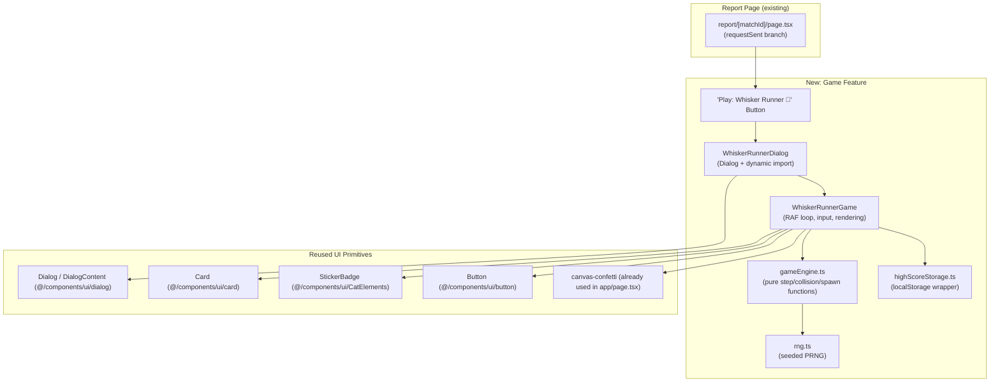
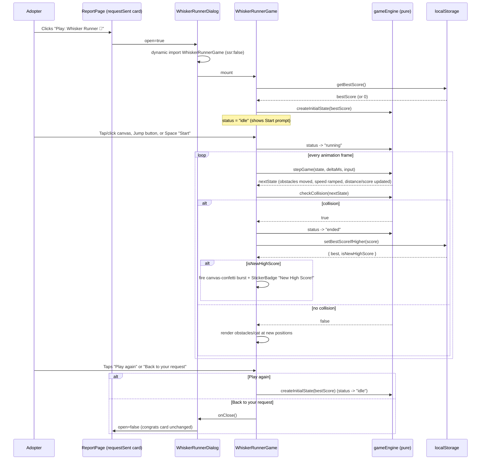

# Design Document: Whisker Runner Game

## Overview

Whisker Runner is a lightweight, on-brand endless runner — a cat-themed take on the Chrome "Dino Game" — surfaced at exactly one moment in the ForeverHome AI product: the adoption-request confirmation card on `src/app/report/[matchId]/page.tsx`. After an adopter sends their adoption request and sees "Congrats on taking the next step with {cat.name}! 🎉", they can optionally open a modal to play a 60-second breather game while they wait to hear back from the shelter, then return to the same card to continue to the 14-Day Coach.

The implementation deliberately avoids any physics engine or game framework. The game is built the same way the rest of the app is built: React state, `requestAnimationFrame` for timing, Tailwind for styling, Framer Motion for the modal's enter/exit and the "new high score" celebration, and the existing `Dialog`, `Button`, `Card`, and `StickerBadge` primitives for chrome. All gameplay logic (physics, collision, spawning, scoring) lives in a small set of pure, framework-free TypeScript functions so it can be property-tested deterministically without touching the DOM, mirroring the existing `compatibilityEngine.ts` pattern already used in this codebase.

This is a replacement for a previous mini-game (`CatMouseGame`) that was removed for being low quality. Whisker Runner is held to a materially higher bar: reused design tokens and components instead of bespoke styling, deterministic/testable core logic instead of ad hoc DOM manipulation, full keyboard + touch + `prefers-reduced-motion` support, and a single, deliberate point of integration rather than being scattered across the app.

### Why this game (product rationale)

The first 14 days after an adoption request is submitted — and especially the days *before* a shelter responds — is an anxiety-prone gap in the adopter's journey. The adopter has emotionally committed ("Congrats on taking the next step with {cat.name}!") but has no task to perform and no immediate feedback loop; this is exactly the kind of dead-air moment where product engagement tends to drop off and users close the tab and forget to come back for the 14-Day Coach later.

Whisker Runner is a deliberate retention and emotional-design intervention placed at that specific gap, not generic arcade filler:

- **Timing**: it only appears after the adoption request is sent, inside the celebratory card — it never competes with or slows down the discovery/matching flow (`/cats`, assessment, or the report itself before a decision is made).
- **Tone**: the copy ("take a quick breather") and visuals (cat obstacles are laundry baskets, brooms, vacuum cleaners, hanging toys — the mundane hazards of a real household) echo the bonding/adjustment theme of the 14-Day Coach rather than being an unrelated arcade reskin.
- **Soft on-ramp, not a detour**: the primary CTA ("Continue to 14-Day Coach →") remains visually dominant and behaviorally unchanged. The game is an optional secondary action that dead-ends back into the same card, so it never becomes an exit ramp away from the adoption flow — it's a five-minute dopamine loop that brings the adopter right back to the next step.
- **Scoped by design, not by omission**: it is intentionally *not* placed on `/cats` or the homepage. Those are discovery/matching surfaces where any delight feature would dilute focus; the congratulations moment is the one place in the product where the user has nothing else to do but wait.

## Architecture

### Component & Module Structure



`WhiskerRunnerGame` is dynamically imported (`next/dynamic`, `ssr: false`) from `WhiskerRunnerDialog` so the game's RAF loop, `localStorage` access, and `window`/`matchMedia` reads never execute during SSR and add zero weight to the initial report-page bundle until the player actually opens the dialog.

### UX Placement Decision: Modal vs. Inline Expandable Panel

**Decision: Modal/overlay (`Dialog`), not an inline expandable panel.**

| | Modal (chosen) | Inline expandable panel |
|---|---|---|
| Layout stability | Report page layout (shelter contact card, buttons) never reflows or shifts scroll position | Expanding a panel inline pushes the "Continue to 14-Day Coach" button down, risking users losing their place or thinking the button moved/disappeared |
| Framing | A modal reads as "a separate, contained little experience" — reinforces the "take a quick breather" copy | An inline panel reads as "more content on this page," which undercuts the deliberate framing of stepping away briefly |
| Dismissal | Reuses the exact `Dialog` pattern already in the codebase (see `shelters/[id]/page.tsx` review dialog) — Escape key, backdrop click, and an explicit close button all already work | Would need bespoke collapse/expand height animation and its own focus-management story |
| Cost when closed | Zero DOM cost — dynamically imported, unmounted entirely when closed | Would need to stay mounted (or remount) inline in an already-complex page component |
| Tradeoff accepted | Fully occludes the congratulations card while open (loses ambient visual context of shelter contact info) | N/A |

The occlusion tradeoff is mitigated by keeping the dialog dismissible at any time (close icon, Escape, backdrop click, and the post-run "Back to your request" button) — the congratulations card is exactly as the player left it the moment they close the modal, since it is not re-rendered or reset by opening the game.

### Sequence: Launching and Playing a Run



## Components and Interfaces

### 1. Report Page Integration (modified)

**File:** `src/app/report/[matchId]/page.tsx` (the `requestSent` branch only)

A new row is added between the shelter contact block and the existing "Continue to 14-Day Coach" button:

```tsx
<div className="mt-5 flex flex-col items-center gap-3">
  <p className="text-sm text-charcoal/60 text-center">
    While you wait to hear back from the shelter, take a quick breather —
  </p>
  <div className="flex flex-col sm:flex-row gap-3 w-full sm:w-auto justify-center">
    <Button
      variant="outline"
      onClick={() => setGameOpen(true)}
      className="gap-2 border-2 border-sage/40 text-sage-deep hover:bg-sage/10"
    >
      <Gamepad2 className="h-4 w-4" />
      Play: Whisker Runner 🐾
    </Button>
    <Button
      onClick={() => router.push(`/coach/${match.catId}-adoption-1`)}
      className="bg-heart hover:bg-heart/90 text-white gap-2"
    >
      Continue to 14-Day Coach
      <ArrowRight className="h-4 w-4" />
    </Button>
  </div>
</div>

<WhiskerRunnerDialog
  open={gameOpen}
  onOpenChange={setGameOpen}
  catName={cat.name}
/>
```

The primary button's `onClick`, styling, and position are unchanged — it remains visually dominant (solid `bg-heart` fill) next to the new secondary `outline` button. `gameOpen` is a single new `useState(false)` alongside the page's existing state.

### 2. `WhiskerRunnerDialog`

**File:** `src/components/game/WhiskerRunnerDialog.tsx`

```tsx
interface WhiskerRunnerDialogProps {
  open: boolean;
  onOpenChange: (open: boolean) => void;
  catName: string;
}
```

Responsibilities:
- Wraps the existing `Dialog` / `DialogContent` from `@/components/ui/dialog` (no new modal primitive).
- Dynamically imports `WhiskerRunnerGame` with `next/dynamic(() => import("./WhiskerRunnerGame"), { ssr: false })` so game code, `localStorage`, and RAF never run server-side or before the player opens it.
- Shows a small `DialogTitle` ("Whisker Runner 🐾") and passes `catName` through so in-game copy can say "Great practice before {catName} comes home!" on the results panel.
- Unmounts the game entirely on close (default `Dialog` behavior) — no game loop keeps running in the background after dismissal.

### 3. `WhiskerRunnerGame`

**File:** `src/components/game/WhiskerRunnerGame.tsx`

```tsx
interface WhiskerRunnerGameProps {
  catName: string;
}
```

Responsibilities:
- Owns the RAF loop and holds the mutable `GameState` in a `useRef` (updated every frame by the pure `stepGame`), with a throttled `useState` "tick" (~every animation frame is fine here — obstacle count is small, ≤ 6 on screen — but the score digits and status banner are the only pieces that must be visually exact every frame; obstacle transforms are written directly via ref-based inline `style.transform` to avoid unnecessary React reconciliation of DOM nodes that don't change shape, only position).
- Reads and applies `prefers-reduced-motion` via `window.matchMedia("(prefers-reduced-motion: reduce)")`: when set, disables the decorative parallax background layer's motion and any non-gameplay CSS transitions, but leaves `stepGame` timing/physics (which is core gameplay, not decoration) untouched.
- Renders three layers, all reusing existing design tokens (`coral`, `sage`, `honey`, `cocoa`, `cream`):
  1. A subtle two-layer parallax background (sky gradient + a slow-drifting cloud/paw-print strip using the existing `.paw-pattern` / `dot-pattern` utility classes) that pauses under reduced motion.
  2. The track: cat sprite and obstacles rendered as **pixel-art (blocky, retro, low-resolution-styled) sprites**, not the app's usual soft/rounded illustration language — a small fixed-size sprite sheet drawn on a fixed low-res grid (e.g. 16x16 or 24x24 "pixel" units) and scaled up crisply. This can be authored either as inline SVG built from a `<rect>` grid (each "pixel" is one `<rect>`, so no new asset pipeline is needed) or as a small raster PNG/SVG sprite sheet rendered with `image-rendering: pixelated` (and `-webkit-crisp-edges` fallback) so the browser never smooths/anti-aliases the scaled-up pixels; either way it uses only the existing `coral`/`sage`/`honey`/`cocoa`/`cream` tokens for the sprite's "pixel" fills instead of the grayscale palette of the original Chrome Dino sprites. Each sprite/obstacle remains an absolutely positioned `div` (or inline `<svg>`) whose `transform: translateX()` is written from the ref on every frame, same as before. This is a **deliberate, scoped exception** to the app's otherwise soft/rounded illustration style (`CatElements.tsx`, `LottieCatRunner`): the blocky retro look is what makes the "just like the Chrome Dino game" familiarity land for players (see requirements Introduction and Requirement 5.5) — everywhere else in the game (background, HUD, dialog chrome, cards, badges) still uses the app's normal rounded/soft visual language and existing UI primitives unchanged.
  3. A HUD row (current score, best score) and, in `idle`/`ended` status, an overlay panel (using `Card`) with the start prompt or the lightweight results panel described below.
- Registers keyboard listeners (`Space` / `ArrowUp` → jump, `ArrowDown` → duck-while-held) and a `pointerdown`/`click` listener on the game canvas/track area itself that also triggers jump — tap-or-click-anywhere-on-the-canvas is the **primary** input, mirroring the single-input, tap-to-jump feel of the Chrome Dino game (Requirement 2.9). The dedicated on-screen Jump `Button` is simply one (redundant, always-visible) way to trigger that same primary jump action; the on-screen Duck `Button`/press-and-hold remains the **secondary** control, since ducking is not reachable via a generic tap. Both on-screen buttons are rendered with `Button` and stay visible on both desktop and mobile, not merely a touch-only fallback, per the accessibility requirement that controls must not be keyboard-only. Clicks/taps on the Duck or Jump buttons themselves stop propagation so they don't also register as a second canvas-tap jump.
- On `status === "ended"`, records `bestScoreBeforeRun` (the best score as it was immediately before this run started) and calls `setBestScoreIfHigher` once (guarded by a ref flag so it only fires once per run). The celebration (`canvas-confetti` burst, reusing the import already used in `app/page.tsx`, plus a `StickerBadge` reading "New High Score! 🎉") fires if **either** `setBestScoreIfHigher`'s `isNewHighScore` is `true` **or** `state.score > bestScoreBeforeRun` — these two signals agree in the normal case, but the second is treated as an equally valid, redundant trigger so the celebration still shows if the primary `isNewHighScore` signal ever fails to report success for a run that did in fact beat the pre-run best (Requirement 4.6).

**No traditional "Game Over" screen.** On collision, the game does not show a modal-within-modal, a skull/fail graphic, or a "Try Again?" dead-end. It transitions directly to a small inline results panel inside the same game surface:

```tsx
<Card className="text-center">
  <CardContent className="pt-6 space-y-2">
    {isNewHighScore && <StickerBadge color="honey">New High Score! 🎉</StickerBadge>}
    <p className="text-2xl font-bold text-cat-dark">{score}</p>
    <p className="text-sm text-charcoal/50">Best: {bestScore}</p>
    <div className="flex gap-2 justify-center pt-2">
      <Button onClick={onRestart}>Play again</Button>
      <Button variant="outline" onClick={onClose}>Back to your request</Button>
    </div>
  </CardContent>
</Card>
```

### 4. `gameEngine` (pure logic module)

**File:** `src/lib/whiskerRunner/gameEngine.ts`

No React, no DOM, no `window` — importable and testable in plain Node/Vitest, exactly like `compatibilityEngine.ts`.

```typescript
export function createInitialState(bestScore: number, seed?: number): GameState;
export function stepGame(state: GameState, deltaMs: number, input: InputState): GameState;
export function requestJump(state: GameState): GameState;
export function setDucking(state: GameState, ducking: boolean): GameState;
export function checkCollision(state: GameState): boolean;
export function computeScore(distance: number): number;
```

### 5. `highScoreStorage`

**File:** `src/lib/whiskerRunner/highScoreStorage.ts`

```typescript
export function getBestScore(): number;
export function setBestScoreIfHigher(score: number): { best: number; isNewHighScore: boolean };
```

Mirrors the existing `localStorage` guard pattern used in `firestoreService.ts` (`try { ... } catch { /* private browsing */ }`), reading/writing under key `"whiskerRunner:bestScore"`, and is a safe no-op (`best: 0, isNewHighScore: false` semantics preserved via in-memory fallback) when `localStorage` throws or `window` is undefined.

### 6. `rng` (seeded PRNG)

**File:** `src/lib/whiskerRunner/rng.ts`

```typescript
export type Rng = () => number; // returns float in [0, 1)
export function createRng(seed: number): Rng; // mulberry32 — deterministic, no external dependency
```

Used exclusively by obstacle spawning so that, given a fixed seed and fixed sequence of `deltaMs` values, an entire run is perfectly reproducible — required for deterministic property-based tests of spawn timing/collision without flakiness.

## Data Models

```typescript
// src/types/whiskerRunner.ts

export type GameStatus = "idle" | "running" | "ended";

export type ObstacleType = "ground" | "air";
// "ground": vacuum cleaner, laundry basket, broom — avoided by jumping
// "air": hanging string / bird toy swinging overhead — avoided by ducking

export interface Obstacle {
  id: string;
  type: ObstacleType;
  x: number;       // left edge, px, in world space (decreases each frame; removed when x + width < 0)
  width: number;   // px
  y: number;       // height of the obstacle's bottom edge above the ground line, px (0 for "ground" obstacles)
  height: number;  // px
}

export interface InputState {
  jumpPressed: boolean; // edge-triggered: true only on the frame the jump input began
  isDucking: boolean;   // level-triggered: true for every frame duck is held
}

export interface GameState {
  status: GameStatus;
  elapsedMs: number;      // total run time, drives speed ramp
  distance: number;       // world-space distance traveled, drives score
  score: number;          // derived from distance via computeScore
  bestScore: number;      // carried over from localStorage at run start; never decreases mid-run
  speed: number;           // px/s, non-decreasing, capped at MAX_SPEED
  catY: number;            // height of cat's feet above the ground line, px (0 = grounded)
  catVelocityY: number;    // px/s, positive = upward
  isDucking: boolean;
  obstacles: Obstacle[];
  rngSeed: number;         // current PRNG state, advanced on every spawn
  nextSpawnDistance: number; // world distance at which the next obstacle spawns
}
```

### Tuning Constants

```typescript
export const GROUND_Y = 0;
export const GRAVITY = -2600;          // px/s^2
export const JUMP_VELOCITY = 780;      // px/s, applied instantaneously on jump
export const STAND_HEIGHT = 56;        // px, cat hurtbox height when standing/jumping
export const DUCK_HEIGHT = 28;         // px, cat hurtbox height while ducking
export const CAT_X = 48;               // px, fixed horizontal hurtbox position
export const CAT_WIDTH = 48;           // px
export const BASE_SPEED = 260;         // px/s at run start
export const MAX_SPEED = 620;          // px/s speed cap
export const SPEED_RAMP_PER_SEC = 6;   // px/s added per elapsed second, until MAX_SPEED
export const MIN_SPAWN_GAP = 340;      // px, minimum world distance between spawns
export const MAX_SPAWN_GAP = 620;      // px, maximum world distance between spawns
export const SCORE_PER_WORLD_UNIT = 0.1; // score = floor(distance * SCORE_PER_WORLD_UNIT)
```

## Algorithmic Pseudocode & Key Functions with Formal Specifications

### `stepGame(state, deltaMs, input): GameState`

```typescript
function stepGame(state: GameState, deltaMs: number, input: InputState): GameState
```

**Preconditions:**
- `state.status === "running"` (calling `stepGame` on an `"idle"` or `"ended"` state is a documented no-op returning `state` unchanged)
- `deltaMs >= 0` and finite (a stalled/backgrounded tab producing a huge `deltaMs` on resume is clamped internally to `MAX_DELTA_MS` before physics integration, to avoid a single frame teleporting the cat through an obstacle — this clamp is the loop invariant enforcement point, not a precondition violation)

**Postconditions:**
- `result.elapsedMs === state.elapsedMs + clamp(deltaMs, 0, MAX_DELTA_MS)`
- `result.speed === min(MAX_SPEED, BASE_SPEED + SPEED_RAMP_PER_SEC * result.elapsedMs / 1000)` and `result.speed >= state.speed` (speed is non-decreasing)
- `result.distance === state.distance + state.speed * clampedDeltaMs / 1000` and `result.distance >= state.distance`
- `result.score === computeScore(result.distance)` and `result.score >= state.score`
- `result.catY >= 0` (gravity integration is clamped at the ground line; landing zeroes `catVelocityY`)
- Every obstacle in `result.obstacles` has `x` strictly less than its value in `state.obstacles` for the same `id` (all obstacles scroll left), except newly spawned obstacles which do not exist in `state.obstacles`
- No obstacle in `result.obstacles` satisfies `x + width < 0` (fully off-screen obstacles are pruned)
- If `result.distance >= state.nextSpawnDistance`, exactly one new obstacle is appended and `result.nextSpawnDistance` is advanced by a value drawn from `[MIN_SPAWN_GAP, MAX_SPAWN_GAP)` via the seeded RNG; `result.rngSeed` reflects the PRNG's advanced internal state
- `result.isDucking === input.isDucking`
- If `input.jumpPressed && state.catY === 0 && !input.isDucking`, upward velocity `JUMP_VELOCITY` is applied to the returned state's velocity integration this frame; otherwise the jump input has no effect (see `requestJump` below — `stepGame` treats `jumpPressed` as already having been resolved through `requestJump`'s edge-triggering, so a held key cannot re-trigger every frame)

**Loop Invariants** (hold across every call in a `running` sequence):
- `state.catY >= 0` always
- `state.speed` is monotonically non-decreasing and `<= MAX_SPEED`
- `state.distance` and `state.score` are monotonically non-decreasing
- `state.obstacles` remains sorted by descending `x` is NOT required, but every element satisfies `x + width >= 0` (pruning invariant)
- `state.score === computeScore(state.distance)` holds after every step (score is always a pure function of distance, never independently mutated)

### `requestJump(state): GameState`

```typescript
function requestJump(state: GameState): GameState
```

**Preconditions:** none (safe to call on any state; it is the *caller's* edge-triggering responsibility, e.g. `keydown` firing once, not `keypress`-repeat)

**Postconditions:**
- If `state.status === "running" && state.catY === 0 && !state.isDucking`: returns a state with `catVelocityY = JUMP_VELOCITY` (all else unchanged); this is the only branch that mutates velocity
- Otherwise (already airborne, ducking, or not running): returns `state` unchanged (idempotent no-op) — this is what prevents double/air-jumping and jump-while-ducking, and — specifically when `state.status !== "running"` (e.g. `"ended"`) — is the mechanism by which jump input has zero gameplay effect after a Run ends, until a new Run is started via "Play again" (Requirement 2.11)

### `setDucking(state, ducking): GameState`

**Preconditions:** none.

**Postconditions:**
- If `state.status !== "running"`: returns `state` unchanged (idempotent no-op) — duck input has zero gameplay effect once a Run has ended, mirroring `requestJump`'s guard, until a new Run is started via the Results_Panel's "Play again" action (Requirement 2.11)
- Otherwise (`state.status === "running"`): `result.isDucking === ducking`; if transitioning into ducking (`ducking === true`) while airborne (`state.catY > 0`), the cat's effective hurtbox height for collision purposes becomes `DUCK_HEIGHT` immediately — ducking is allowed mid-air (this is intentional: a low-hanging "air" obstacle can be avoided by ducking even if the player mistimed a jump into it) — all other fields unchanged.

### `checkCollision(state): boolean`

```typescript
function checkCollision(state: GameState): boolean
```

**Preconditions:** `state.obstacles` contains only obstacles with `width > 0 && height > 0` (enforced by the spawn function; not re-validated here).

**Postconditions:**
- Returns `true` if and only if there exists an obstacle `o` in `state.obstacles` such that the cat's current axis-aligned hurtbox — `x ∈ [CAT_X, CAT_X + CAT_WIDTH]`, `y ∈ [state.catY, state.catY + (state.isDucking ? DUCK_HEIGHT : STAND_HEIGHT)]` — overlaps `o`'s box — `x ∈ [o.x, o.x + o.width]`, `y ∈ [o.y, o.y + o.height]` — on both axes simultaneously
- Deterministic and side-effect free: calling it twice on the same `state` returns the same result
- This is the rule that makes obstacle `type` meaningful even though collision itself is type-agnostic: `"ground"` obstacles have `y = 0`, so only a grounded, non-jumping cat's hurtbox reaches them; `"air"` obstacles have `y > STAND_HEIGHT - height` positioned so a standing *or jumping* cat's hurtbox reaches them but a ducking cat's shorter hurtbox does not — jumping is therefore the wrong action against an air obstacle, matching the classic dino-game duck-vs-jump dilemma described in the requirements

### `computeScore(distance): number`

**Preconditions:** `distance >= 0`.

**Postconditions:** `result === Math.floor(distance * SCORE_PER_WORLD_UNIT)`, so `result >= 0` and is a monotonically non-decreasing function of `distance`.

### `getBestScore()` / `setBestScoreIfHigher(score)`

```typescript
function getBestScore(): number
function setBestScoreIfHigher(score: number): { best: number; isNewHighScore: boolean }
```

**Preconditions (`setBestScoreIfHigher`):** `score >= 0` and finite.

**Postconditions:**
- `getBestScore()` returns `0` if no value has ever been persisted, if `localStorage` is unavailable (SSR, private browsing throwing on access), or if the stored value fails to parse as a non-negative finite number — never throws.
- `setBestScoreIfHigher(score)`: if `score > getBestScore()`, persists `score` and returns `{ best: score, isNewHighScore: true }`; otherwise persists nothing and returns `{ best: getBestScore(), isNewHighScore: false }`. The persisted best score is monotonically non-decreasing across any sequence of calls, regardless of `localStorage` failures (failures degrade to in-memory-only tracking for that session rather than throwing).

## Example Usage

```typescript
import { createInitialState, stepGame, requestJump, setDucking, checkCollision } from "@/lib/whiskerRunner/gameEngine";
import { getBestScore, setBestScoreIfHigher } from "@/lib/whiskerRunner/highScoreStorage";

let state = createInitialState(getBestScore());
state = { ...state, status: "running" };

// Game loop (inside a requestAnimationFrame callback in WhiskerRunnerGame):
function onFrame(deltaMs: number, input: InputState) {
  if (input.jumpPressed) state = requestJump(state);
  state = setDucking(state, input.isDucking);
  state = stepGame(state, deltaMs, input);

  if (checkCollision(state)) {
    const bestScoreBeforeRun = state.bestScore;
    const { best, isNewHighScore } = setBestScoreIfHigher(state.score);
    state = { ...state, status: "ended", bestScore: best };
    // isNewHighScore and (state.score > bestScoreBeforeRun) are redundant, equivalent
    // signals (Property 12) — either fires the celebration (Requirement 4.6).
    if (isNewHighScore || state.score > bestScoreBeforeRun) fireConfettiAndBadge();
  }
}

// Restart, preserving the best score:
function onRestart() {
  state = createInitialState(state.bestScore);
}
```

## Correctness Properties

*A property is a characteristic or behavior that should hold true across all valid executions of a system.*

### Property 1: Non-decreasing distance and score

*For any* valid `GameState` in status `"running"` and *any* non-negative `deltaMs`, calling `stepGame` SHALL produce a resulting state whose `distance` and `score` are both greater than or equal to the input state's `distance` and `score`.

**Validates: Requirements 3.1**

### Property 2: Score is a pure function of distance

*For any* `GameState` produced by any sequence of `stepGame` calls, `state.score` SHALL equal `computeScore(state.distance)` exactly.

**Validates: Requirements 3.1**

### Property 3: Cat never goes below ground

*For any* sequence of `stepGame` calls starting from `createInitialState`, `catY` SHALL be greater than or equal to `0` in every resulting state.

**Validates: Requirements 2.4**

### Property 4: Speed is non-decreasing and bounded

*For any* sequence of `stepGame` calls, `speed` SHALL be monotonically non-decreasing across the sequence and SHALL never exceed `MAX_SPEED`.

**Validates: Requirements 2.7**

### Property 5: Jump only affects grounded, non-ducking cats

*For any* `GameState` where `catY > 0` (airborne) or `isDucking === true`, calling `requestJump` SHALL return a state with `catVelocityY` unchanged from the input.

**Validates: Requirements 2.5**

### Property 6: Jump is a no-op when not running

*For any* `GameState` with `status !== "running"`, calling `requestJump` SHALL return the input state unchanged.

**Validates: Requirements 2.5**

### Property 7: Obstacle pruning invariant

*For any* `GameState` produced by `stepGame`, no obstacle in `state.obstacles` SHALL satisfy `x + width < 0`.

**Validates: Requirements 2.6**

### Property 8: Obstacles only move leftward

*For any* obstacle present in both the input and output of a `stepGame` call (matched by `id`), the output obstacle's `x` SHALL be strictly less than the input obstacle's `x`.

**Validates: Requirements 2.1, 2.6**

### Property 9: Collision determinism

*For any* fixed `GameState`, calling `checkCollision` on it multiple times SHALL return the same boolean result every time.

**Validates: Requirements 2.8**

### Property 10: Ducking reduces hurtbox height

*For any* `GameState` and *any* obstacle of type `"air"` positioned such that a standing cat's hurtbox overlaps it, setting `isDucking` to `true` via `setDucking` while all other fields (including `x`/`catY`) stay fixed SHALL cause `checkCollision` to no longer report a collision with that obstacle, provided the reduced `DUCK_HEIGHT` hurtbox no longer overlaps it vertically.

**Validates: Requirements 2.3, 2.8**

### Property 11: Best score never decreases

*For any* sequence of calls to `setBestScoreIfHigher` with arbitrary non-negative scores, `getBestScore()` after each call SHALL be greater than or equal to its value before that call, and SHALL equal the maximum score ever passed to `setBestScoreIfHigher`.

**Validates: Requirements 3.2, 3.4**

### Property 12: New-high-score flag correctness

*For any* call to `setBestScoreIfHigher(score)`, the returned `isNewHighScore` SHALL be `true` if and only if `score` is strictly greater than the best score persisted immediately before the call. Consequently, the component-level celebration condition (`isNewHighScore || score > bestScoreBeforeRun`) is redundant-but-consistent by construction: since `bestScoreBeforeRun` is exactly the value `getBestScore()` returns immediately before `setBestScoreIfHigher` is called, `score > bestScoreBeforeRun` and `isNewHighScore` SHALL always agree, so the celebration fires under either signal without ever producing a false negative if one signal were to fail to report success.

**Validates: Requirements 3.3, 4.3, 4.6**

### Property 13: Restart preserves best score, resets everything else

*For any* `GameState` with an arbitrary `bestScore`, calling `createInitialState(state.bestScore)` SHALL produce a state with `status === "idle"`, `distance === 0`, `score === 0`, `obstacles.length === 0`, and `bestScore` equal to the value passed in.

**Validates: Requirements 4.4**

### Property 14: No NaN/Infinity leakage

*For any* sequence of valid `stepGame`, `requestJump`, and `setDucking` calls from a valid initial state, every numeric field of the resulting `GameState` (`distance`, `score`, `speed`, `catY`, `catVelocityY`, `elapsedMs`) SHALL be finite.

**Validates: Requirements 2.1, 2.2, 2.3, 2.4**

### Property 15: Deterministic replay

*For any* fixed seed and *any* fixed sequence of `(deltaMs, input)` pairs, replaying that exact sequence through `createInitialState(bestScore, seed)` followed by the same `stepGame`/`requestJump`/`setDucking` calls SHALL always produce an identical final `GameState`.

**Validates: Requirements 7.3**

### Property 16: Duck is a no-op when not running

*For any* `GameState` with `status !== "running"`, calling `setDucking` SHALL return the input state unchanged.

**Validates: Requirements 2.11**

## Error Handling

| Scenario | Behavior |
|---|---|
| `localStorage` throws (private browsing, storage disabled) on `getBestScore`/`setBestScoreIfHigher` | Caught internally; falls back to `0` / in-memory-only tracking for that session. Never throws, never blocks gameplay. |
| Stored best-score value is corrupted/non-numeric | Treated as `0`; overwritten with a valid value on the next completed run. |
| `window`/`document` unavailable (SSR) | `WhiskerRunnerGame` is only ever mounted client-side via `next/dynamic({ ssr: false })`; the pure `gameEngine`/`highScoreStorage` modules guard every `window`/`localStorage` access with `typeof window !== "undefined"` so they remain safely importable in any environment (including Vitest/Node for tests). |
| Tab backgrounded/throttled, producing a very large `deltaMs` on the next visible frame | Clamped to `MAX_DELTA_MS` inside `stepGame` before physics integration, preventing the cat from being teleported through an obstacle in a single frame. |
| User closes the dialog mid-run | The `Dialog` unmounts `WhiskerRunnerGame` entirely (its `useEffect` cleanup cancels the RAF loop and removes keyboard listeners); no game state or timers persist in the background. The best score already reflects only completed/collided runs, so closing mid-run never corrupts `localStorage`. |
| `canvas-confetti` import fails or throws (unlikely, already used elsewhere in the app) | Wrapped in a try/catch around the celebratory call; the "New High Score!" `StickerBadge` text still renders regardless, so failure of the decorative confetti never blocks the results panel. |

## Testing Strategy

### Unit Tests (Example-Based)

- `createInitialState` returns the documented defaults (status `"idle"`, zeroed distance/score/obstacles, carried-over `bestScore`).
- `stepGame` on a non-`"running"` status is a no-op.
- A single fixed jump scenario clears a fixed-position ground obstacle; a single fixed duck scenario clears a fixed-position air obstacle; a fixed "do nothing" scenario against a ground obstacle collides.
- `highScoreStorage` round-trips a value through a mocked `localStorage`, and degrades gracefully when `localStorage.setItem` is mocked to throw.
- `WhiskerRunnerDialog` renders nothing/no game DOM when `open === false`, and dynamically mounts the game when `open === true`.
- Report page: the `requestSent` branch renders the "Play: Whisker Runner 🐾" button and the unchanged "Continue to 14-Day Coach" button with its existing `onClick`/href behavior intact.

### Property-Based Tests

Following the codebase's existing convention (`fast-check`, ≥100 runs per property, tag format `Feature: whisker-runner-game, Property {N}: {title}`), all 16 properties above are implemented as PBTs against the pure `gameEngine`/`highScoreStorage` functions, generating:
- Arbitrary valid `GameState`s (bounded, finite numeric fields) via `fc.record`.
- Arbitrary `deltaMs` in `[0, 5000]` (including large "backgrounded tab" values to exercise the clamp).
- Arbitrary `InputState` combinations and arbitrary sequences of frames (`fc.array` of `(deltaMs, input)` tuples) for the determinism/monotonicity/replay properties.

**Library:** `fast-check` (already a dev dependency; no new dependency needed).

### Integration Tests

- Full-run simulation: drive `stepGame` in a loop with a fixed seed until an obstacle is guaranteed to spawn, assert the obstacle appears with valid bounds and is eventually pruned after scrolling past `x + width < 0`.
- End-to-end best-score flow: simulate two consecutive "runs" (via the pure engine) where the second scores higher than the first, assert `localStorage` reflects only the higher score.

### Manual/Accessibility Checks

- Keyboard-only playthrough (Space to jump, Down arrow held to duck) with no mouse/touch input.
- Touch-only playthrough using only the on-screen Jump/Duck buttons.
- `prefers-reduced-motion: reduce` (via OS setting or DevTools emulation) confirms the parallax background stops animating while jump/duck/scroll gameplay remains fully playable.
- Verify the modal is fully dismissible via Escape, backdrop click, and the explicit close button at every game status (`idle`, `running`, `ended`).

## Performance Considerations

- The RAF loop mutates a `useRef`-held `GameState` and writes obstacle/cat positions directly to `style.transform` on their DOM nodes, avoiding a full React re-render every frame; React state is only touched for the score/status HUD, and even that can be throttled to update at a lower rate (e.g. every ~100ms) than the 60fps physics loop without any visible impact, since score is an integer that rarely changes faster than that.
- Obstacle count on screen is small by construction (`MIN_SPAWN_GAP`/`MAX_SPAWN_GAP` combined with `MAX_SPEED` bound the maximum simultaneous on-screen obstacles to a handful), so no object pooling or virtualization is needed.
- `WhiskerRunnerGame` is dynamically imported with `ssr: false`, so its code, `lottie-react`-free sprite rendering, and RAF loop add zero cost to the report page's initial load and are only fetched when the player opens the dialog.
- No network requests occur during gameplay; the only I/O is synchronous `localStorage` reads/writes at run start/end, which are cheap and already guarded against blocking on failure.

## Security Considerations

- No new network-exposed endpoints, authentication, or authorization surface is introduced — the entire feature is client-side-only, backed by `localStorage`, consistent with the fact it must not require login per the placement requirements.
- No user-supplied data is rendered as HTML/markup anywhere in the game (score/best-score are numbers; the only string interpolated into JSX, `catName`, already flows through the existing report page's JSX-escaped rendering exactly as it does today in the surrounding congratulations card, so no new injection surface is added).
- `localStorage` key (`whiskerRunner:bestScore`) stores only a non-negative integer, never PII, adopter identity, or shelter data.

## Dependencies

No new package dependencies are introduced. The feature reuses:
- `framer-motion` (already installed) — dialog enter/exit, results-panel transition.
- `lucide-react` (already installed) — `Gamepad2` (or similar) icon for the trigger button.
- `canvas-confetti` (already installed, already used in `app/page.tsx`) — new-high-score celebration burst.
- `@/components/ui/dialog`, `@/components/ui/button`, `@/components/ui/card`, `@/components/ui/CatElements` (StickerBadge) — existing UI primitives.
- `fast-check` (already a dev dependency) — property-based tests for `gameEngine`/`highScoreStorage`.
