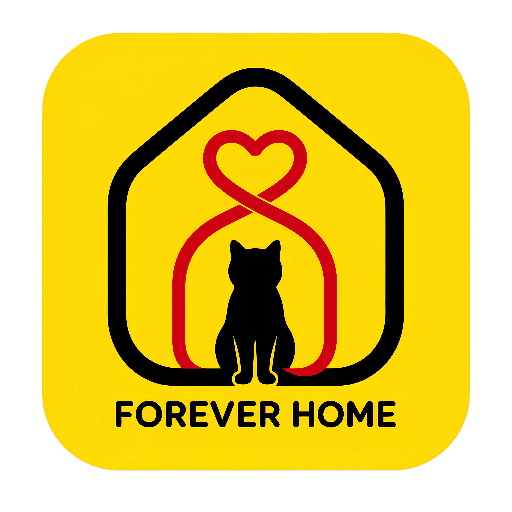

# 🐾 ForeverHome AI

> **Built for [#HackTheKitty 2026](https://hackthekitty.com/) — World Cat Domination Day Hackathon**
>
> **🌐 [Live App →](https://forever-home-ai.vercel.app/)** — Available as a website and installable PWA
>
> **📋 [Full Project Report →](docs/project-report.md)** — Executive summary, architecture, testing matrix, and submission checklist.

**Preventing cat returns before they happen — through AI-powered compatibility assessment and post-adoption coaching.**



---

## 🎯 The Problem

**7–20% of shelter cats are returned within 6 months** — not because they're "unadoptable," but because of preventable mismatches between a cat's needs and an adopter's lifestyle. New adopters panic at normal adjustment behaviors (hiding, not eating) because no one explained what to expect. Every return costs shelters time, emotional resources, and capacity — and each returned cat becomes harder to adopt again.

---

## 💡 Our Solution

ForeverHome AI is a **decision-support and adopter-education platform** that helps shelters prevent returns at every stage of the adoption journey. Unlike generic pet apps, every feature is informed by real shelter workflows and cat behavioral science.

### 🔐 Account Required — Full User Journey

The app is a **gated experience** — users must create an account before accessing any tools:

```
1. Login / Register (Google OAuth or Email/Password)
     ↓
2. Onboarding — Role Selection (Adopter or Shelter Staff)
     ↓  (if Adopter)
   Profile Setup: home type, children, other pets, experience, work schedule,
   personality preference, age preference, special needs openness
     ↓  (if Shelter)
   Shelter setup: name, address, phone, email → optional: add cats
     ↓
3. Dashboard — Personalized command center
   • Profile completion status
   • Past assessment history with risk badges
   • Active adoptions with day counter
   • Quick links: Browse Cats, View Report, Open Coach
     ↓
4. Explore Cats → Take Assessment → Get Report → Start 14-Day Coach
```

**Why account-first?** Compatibility data (lifestyle, experience, home environment) must persist across sessions. The 14-day coach requires check-in history. Shelters need verified identities for adoption requests. A demo-only experience can't provide the continuity adopters need during the critical two-week settling period.

### Every Feature — What It Does & Why

| Stage | Feature | What It Does | AI Implementation | Why We Built It |
|-------|---------|-------------|-------------------|-----------------|
| **Pre-Adoption** | Compatibility Assessment | 10-question quiz (5 lifestyle + 5 scenario) → deterministic engine → transparent risk report | **AI Counselor** explains the report in warm, natural language — but never makes the matching decision | Shelters need transparent, auditable matching; AI is perfect for narrative explanation, dangerous for life-altering decisions |
| **Pre-Adoption** | AI Quick Match (Cat Profile) | 4-question chat widget on every cat page gives instant compatibility preview in 30 seconds | Calls `/api/counselor` with adopter answers + cat profile → returns personalized prose | Lowers barrier to assessment; users get instant feedback before committing to the full 10-question quiz |
| **Pre-Adoption** | Whisker Runner Game | Endless-runner platformer with custom cat sprites, progressive difficulty, high scores | No AI — pure Canvas + TypeScript engine with deterministic RNG | Engagement & brand building: keeps users on the platform longer, reinforces cat theme, provides fun mental breaks between serious assessment steps |
| **Pre-Adoption** | Cat Profile Pages | Rich profiles with photo gallery, backstory, personality traits, behavior bars, medical notes, care requirements, ideal home description | No AI in data — AI Quick Match widget provides interactive compatibility preview | Adopters need deep behavioral context before committing; a single photo isn't enough to decide on a 15-year commitment |
| **Post-Adoption** | 9 Lives Protocol | Gamified 14-day curriculum — one challenge unlocked per day, from "The Ghost" (hiding) to "The Commander Ascends" (routine established) | No AI — static expert-written curriculum with actionable tips, behavioral explanations, red-flag warnings | Turns panic-inducing unknowns into named, conquerable milestones; gives adopters a shared vocabulary with shelter staff |
| **Post-Adoption** | AI Coach (Mr. Cat) | Chat interface with cat-specific behavioral advice, photo sharing, daily check-in integration | Calls `/api/coach` — injected with full cat behavioral profile + complete check-in history + current adoption day for context-aware responses | Generic pet advice doesn't help; Mr. Cat knows *this specific cat* and *this specific adopter's history* — contextual guidance is exponentially more useful |
| **Post-Adoption** | Daily Check-ins | 4 toggles (eating, litter, hiding, activity) + free-text note — tracked day-by-day | No AI — structured data feeds into the coach for personalized context | Creates a behavioral timeline shelters can review; declining patterns trigger Smart Escalation |
| **Post-Adoption** | Smart Escalation | Priority ticket to shelter behaviorists with last 3 color-coded check-ins + chat context summary + 24h response badge | No AI in escalation logic — deterministic pattern detection (missed check-ins, declining metrics) | Shelters are short-staffed — they can't monitor every adoption. Escalation surfaces only the cases that need human attention |
| **Post-Adoption** | Deterministic Medical Safety | 26 emergency keywords scanned before every AI call — returns immediate emergency response without contacting AI | **No AI — deterministic pre-scan intercepts AI pipeline** | AI hallucination on medical questions is unacceptable. This is defense-in-depth: emergencies never reach the AI |
| **Shelter Side** | Insights Dashboard | Active adoptions, cats needing attention, common compatibility concerns ranked by frequency | No AI — aggregated statistics from adoption data | Turns individual assessments into organizational learning; shelters can tune their adoption criteria based on real patterns |
| **Shelter Side** | Shelter Console | Cat inventory CRUD, adoption request tracking, staff management, concern analytics | No AI — administrative tools | Shelters need operational tools, not just adopter-facing features |
| **Everyone** | Fun Facts Slideshow | 19 animated cards with rotating cat trivia on the landing page — Egyptian gods, healing purrs, nose prints, space cats, Viking pets, etc. | No AI — beautifully designed static content with auto-rotation and manual navigation | Educational engagement: turns wait time into discovery. Adopters learn about cat behavior even before adopting, setting realistic expectations |
| **Everyone** | TTS Narration | Compatibility reports read aloud via Web Speech API | No AI — browser-native speech synthesis | Accessibility: visually impaired adopters can hear their full report |

### Why No Shelter-Adopter Chat

**We intentionally did NOT build direct messaging between shelters and adopters.** Here's why:

1. **Shelters are severely understaffed** — most shelters operate with 2-5 staff managing hundreds of animals. Real-time chat would create an unsustainable support burden they cannot fulfill.
2. **Unanswered messages cause frustration** — an adopter sending a message and waiting 3 days for a reply creates a worse experience than no chat at all.
3. **The AI Coach fills the gap** — Mr. Cat provides instant, 24/7 behavioral support that shelters physically cannot. For urgent issues, Smart Escalation creates a structured, prioritized ticket rather than an open-ended chat.
4. **Escalation is deliberate, not casual** — requiring adopters to intentionally escalate (rather than casually message) ensures shelter staff only see cases that genuinely need their attention.
5. **Phone/email for real emergencies** — emergency contact information is permanently visible in the coach interface for situations that require immediate human intervention.

This was a deliberate design trade-off: **AI handles 90% of questions instantly → Smart Escalation surfaces the 10% that need humans → shelter staff focus on high-impact interventions.**

### Why a Mini-Game?

Whisker Runner isn't filler — it's strategic:

1. **Retention & dwell time** — hackathon judges and adopters spend more time on the platform when there's something fun between serious features
2. **Brand reinforcement** — the cat dodging obstacles and collecting treats mirrors the adoption journey itself (overcoming challenges, finding rewards)
3. **PWA showcase** — the game demonstrates that the Progressive Web App handles intensive Canvas rendering and keyboard input, proving it's a real app, not just a form
4. **No account required** — the game works for unauthenticated guests, serving as a low-friction entry point before signup
5. **Technical depth** — custom sprite animations, deterministic RNG, collision detection, high score persistence — shows engineering capability beyond CRUD

### Full Screen-by-Screen Feature Map

| Screen | Route | Features |
|--------|-------|----------|
| **Landing** | `/` | Interactive cat card stack (6 cats, animated transitions), marquee bar, "How It Works" 3-step cards, testimonials with paw ratings, CTA section, Fun Facts Slideshow (19 cards) |
| **Login** | `/login` | Google OAuth + email/password, XSS-protected redirect, demo credentials hint |
| **Register** | `/register` | Email/password signup with validation |
| **Onboarding** | `/onboarding` | Role selection (Adopter/Shelter), 12-field adopter profile, 3-step shelter setup, animated paw loading states |
| **Dashboard** | `/dashboard` | Greeting with name, role toggle (multi-role users), profile completion card, past assessments with risk badges, active adoptions with day counter, quick-action links |
| **Cat Browse** | `/cats` | Grid of 9 cats with photos, personality tags, compatibility scores, wishlist hearts |
| **Cat Profile** | `/cats/[catId]` | Photo gallery with captions, behavior bars (7 dimensions), personality traits, backstory narrative, health/care badges, medical notes, ideal home description, shelter info, AI Quick Match chat widget, adoption process steps, Quick Facts sidebar card |
| **Assessment** | `/assessment/[catId]` | 5 lifestyle questions + 5 scenario questions, progress indicator, scenario-based UI |
| **Report** | `/report/[matchId]` | Risk level badge (green/yellow/red), triggered rules with descriptions, mitigation guidance, AI counselor explanation, TTS narration, alternative cat recommendations |
| **Coach** | `/coach/[adoptionId]` | 9 Lives Protocol timeline (visual progress bar), daily check-in (4 toggles + note), Mr. Cat AI chat with photo upload, emergency contact banner, Smart Escalation button |
| **Insights** | `/insights` | Shelter-side stats, adoption patterns, common concern analysis (public view) |
| **Saved** | `/saved` | Wishlist with cat cards, quick-remove, link to assessment |
| **Outcome** | `/outcome` | With/without ForeverHome comparison story |
| **Shelter Console** | `/shelter/*` | Dashboard, cat inventory CRUD, adoption request tracking, concern analytics, staff management — all role-guarded |
| **Profile** | `/profile` | Edit adopter profile, view saved cats, account settings |
| **About** | `/about` | Architecture overview + technology deep-dive |

---

## ✨ Key Features

### 🔬 Transparent Compatibility Engine (No Black-Box AI)

The core assessment uses **9+ deterministic rules** — no machine learning, no black-box decisions. Every concern is explained with exact rule logic shown to the adopter:

| Rule | What It Checks |
|------|---------------|
| `stress-noise` | High stress sensitivity + noisy household |
| `stress-children` | Not child-comfortable + young children at home |
| `energy-absence` | High-energy cat + 10+ hours away + no vertical space |
| `vertical-space` | Needs climbing space + no enrichment plan |
| `dog-incompatibility` | Dog-unfriendly + resident dog(s) |
| `special-care` | Medical needs + adopter uncomfortable with care |
| `indoor-safety` | Indoor-only requirement + insecure home |
| `unknown-compatibility` | Unknown behavioral data in relevant areas |
| `senior-cat-absence` | Senior with medical needs + long daily absence |
| `fiv-experience` | FIV+ cat + no prior cat/special-needs experience |

**Risk Tiers**: `Low` (0 significant concerns) → `Moderate` (1 concern) → `High` (2+ concerns)

For Moderate/High matches, the engine automatically recommends alternative cats with better compatibility — not to reject the match, but to give options.

### 🗓️ 9 Lives Protocol™ — Gamified Post-Adoption Curriculum

Inspired by the myth that cats have 9 lives, we flipped the concept: instead of losing lives, adopters and cats **survive each challenge together**, building trust daily:

```
Day 1 👻 "The Ghost"        — Surviving the hiding phase
Day 2 🍗 "The Hunger Strike" — Encouraging the first meal
Day 3 🌙 "The 3 AM Zoomies"  — Managing night activity
Day 4 🚽 "The Litterbox Rebellion" — Solving bathroom issues
Day 5 🛋️ "The Furniture Test" — Protecting your couch
Day 6 😺 "The Belly Trap"    — Learning cat body language
Day 7 🪟 "The Window Watcher"  — Managing barrier frustration
Day 8 🏠 "The Scent Swap"    — Expanding territory
Day 9 👑 "The Commander Ascends" — Permanent routine established
Days 10-14: Maintenance Mode — consolidation phase
```

Each day unlocks a new "Life" with actionable tips, behavioral explanations, and red-flag warnings.

### 🤖 Context-Aware AI Coach (Mr. Cat)

Unlike generic pet advice, Mr. Cat is injected with:

- **Full cat behavioral profile** (energy level, stress sensitivity, children/dog/cat compatibility, medical needs)
- **Complete check-in history** (eating patterns, litter habits, hiding behavior, activity level, notes)
- **Current adoption day** (contextualizing what's normal at each stage)
- **Optional photo analysis** — adopter can share a photo; AI describes what it sees

Example: *"I see Barnaby has been eating well (good sign!) but still hiding on Day 3. This is completely normal — let's talk about why..."*

### 🚨 Deterministic Medical Safety Layer

**26 emergency keywords** are scanned before any AI call. If detected, the system returns an immediate medical emergency response without ever contacting the AI:

- "trouble breathing", "seizure", "unconscious", "collapse", "poison", "bleeding", "unresponsive"...

This is defense-in-depth: even if the AI hallucinates, the safety layer catches emergencies first.

### 📊 Shelter Insights Dashboard

- Active adoptions overview with check-in status
- Cats needing attention (missed check-ins, concerning patterns)
- Common compatibility concerns ranked by frequency
- Turns individual assessments into organizational learning

### 🎮 Whisker Runner Mini-Game

An endless-runner platformer built in Canvas + TypeScript where the cat dodges obstacles, collects treats, and competes for high scores. Complete with:
- Custom cat sprite animations (run, jump, idle, hit, celebration)
- Obstacle generation with progressive difficulty
- Deterministic RNG for reproducible levels
- High score persistence (Firestore auth / sessionStorage demo)
- Integration test suite with property-based obstacle testing

### 🗣️ TTS Narration

Compatibility reports feature text-to-speech for accessibility — the Web Speech API reads reports aloud with a configurable speaking rate.

---

## 🏗️ Architecture

```
┌─────────────────────────────────────────────────────────┐
│                    FOREVERHOME AI                        │
├─────────────────────────────────────────────────────────┤
│  FRONTEND — Next.js 16 App Router + Tailwind CSS v4     │
│  ┌──────────┐  ┌──────────────┐  ┌───────────────────┐  │
│  │ 9 Cats   │  │  10-Question │  │  Compatibility    │  │
│  │ Browsing │─▶│  Assessment  │─▶│  Report + AI      │  │
│  │ (profiles│  │  Quiz        │  │  Explanation +    │  │
│  │  photos) │  │  (scenarios) │  │  TTS Narration    │  │
│  └──────────┘  └──────────────┘  └───────────────────┘  │
│                                               │         │
│  ┌────────────────────────────────────────┐   │         │
│  │         14-Day AI Coach                │◀──┘         │
│  │  ┌──────────┐ ┌──────────┐ ┌────────┐  │            │
│  │  │ Daily    │ │ 9 Lives  │ │ Mr. Cat│  │            │
│  │  │ Check-ins│ │ Timeline │ │ AI Chat│  │            │
│  │  └──────────┘ └──────────┘ └────────┘  │            │
│  │              ┌──────────────────┐       │            │
│  │              │ Smart Escalation │       │            │
│  │              │ (Human handoff)  │       │            │
│  │              └──────────────────┘       │            │
│  └────────────────────────────────────────┘            │
│                                                         │
│  ┌──────────────────┐  ┌──────────────────────────┐     │
│  │ Shelter Insights │  │ Whisker Runner Game      │     │
│  │ (Adoption stats, │  │ (Canvas endless runner)  │     │
│  │  concern patterns│  │                          │     │
│  └──────────────────┘  └──────────────────────────┘     │
├─────────────────────────────────────────────────────────┤
│  SERVER — Next.js API Route Handlers (never client)     │
│  ┌────────────────────┐  ┌─────────────────────────┐   │
│  │ Gemini AI (v1beta)  │  │ Firebase Auth + Firestore │  │
│  │ • 3-tier model chain│  │ • 10 collections RBAC    │  │
│  │ • Rate-limit fallback│  │ • ID token verification  │  │
│  │ • 8s timeout/retry  │  │ • jose JWKS validation   │  │
│  │ • Image input support│  │ • aiLogs (write-only)    │  │
│  └────────────────────┘  └─────────────────────────┘   │
│  ┌──────────────────────────────────────────────────┐   │
│  │              Security Layer                       │   │
│  │  - Medical keywords scan (deterministic, pre-AI)  │   │
│  │  - Firebase ID token verification on all endpoints │   │
│  │  - UID matching (prevents IDOR/profile exfiltration)│  │
│  │  - Field type+size validation in Firestore rules   │   │
│  └──────────────────────────────────────────────────┘   │
├─────────────────────────────────────────────────────────┤
│  CORE ENGINE — Client-side TypeScript (strict mode)     │
│  ┌──────────────────────────────────────────────────┐   │
│  │  Compatibility Assessment Engine                 │   │
│  │  • 10 deterministic rules                        │   │
│  │  • No AI in matching decisions                   │   │
│  │  • Alternative cat recommendations               │   │
│  │  • Non-recursive alt-finding (stack safe)        │   │
│  └──────────────────────────────────────────────────┘   │
│  ┌──────────────────────────────────────────────────┐   │
│  │  Medical Escalation Layer                        │   │
│  │  • 26 emergency keywords                         │   │
│  │  • Intercepts BEFORE any AI API call             │   │
│  │  • Routes to vet/human immediately               │   │
│  └──────────────────────────────────────────────────┘   │
└─────────────────────────────────────────────────────────┘
```

### Key Design Decisions

1. **Deterministic compatibility (no AI)** — transparent, consistent, no hallucination risk in matching
2. **Server-side AI only** — Gemini API keys never exposed to the browser
3. **Cascading model failover** — 3 Gemini model tiers with auto-degradation on rate limits
4. **Deterministic safety layer** — medical keywords intercepted before any AI call (defense-in-depth)
5. **Demo-first development** — entire app works without Firebase, using sessionStorage + static data
6. **TypeScript strict mode** — full type safety across entire codebase
7. **No Firebase Admin SDK** — token verification via `jose` against Google JWKS, avoiding service account secrets

---

## 🛠️ Tech Stack

| Layer | Technology | Purpose |
|-------|-----------|---------|
| Framework | **Next.js 16** (App Router, Turbopack) | Full-stack React framework |
| Language | **TypeScript 5** (strict mode) | Type safety across 151 source files |
| Styling | **Tailwind CSS v4** + custom design tokens | Consistent warm-themed UI |
| Components | **shadcn/ui** + custom CatElements | Accessible, composable UI |
| Auth | **Firebase Authentication** | Email/password + Google sign-in |
| Database | **Cloud Firestore** (10 collections) | User data, cats, assessments, adoptions |
| AI | **Google Gemini API** (v1beta, 3-tier failover) | Counselor + Coach + Assistant |
| Animation | **Framer Motion** | Smooth page transitions, modals, drawers |
| Game | **Canvas API + TypeScript** | Whisker Runner endless runner |
| TTS | **Web Speech API** | Report narration for accessibility |
| PWA | **@ducanh2912/next-pwa** | Offline support, installable web app |
| Testing | **Vitest + fast-check** (22 suites) | Unit, integration, property-based |
| Linting | **ESLint 9** (next/core-web-vitals) | Code quality enforcement |
| Deployment | **Vercel** | Edge-optimized hosting |

---

## 🔬 Testing — Property-Based & Edge Cases

**22 test files** covering deterministic correctness with **fast-check** (property-based testing):

| Test Suite | Lines | What It Tests |
|------------|-------|--------------|
| `compatibilityEngine.rules.properties.test.ts` | 732 | Random adopter × cat combos — verifies all 10 rules trigger correctly |
| `compatibilityEngine.rules.test.ts` | 683 | Individual rule edge cases (null fields, boundary values) |
| `compatibilityEngine.properties.test.ts` | 764 | Overall engine invariants (level monotonicity, concern count bounds) |
| `coachResponse.properties.test.ts` | 651 | AI coach prompt integrity across random inputs |
| `coachEdgeCases.test.ts` | 425 | Medical keywords, image handling, empty messages |
| `fallbackMechanism.properties.test.ts` | 530 | Fallback response coverage for all message patterns |
| `checkinData.properties.test.ts` | 819 | Check-in data validation, day boundaries, progress math |
| `checkinFlow.integration.test.ts` | 769 | Full check-in lifecycle: create → update → verify |
| `error-handling.test.ts` | 1024 | Network failures, timeouts, retries, edge values |
| `accessibility.property.test.ts` | 354 | WCAG patterns, alt text, labeling properties |
| `medicalEscalation.test.ts` | 448 | All 26 keywords, case insensitivity, partial matches |
| `demoCats.test.ts` | 493 | Cat data integrity, required fields, enum values |
| `gameEngine.test.ts` | 763 | Collision detection, scoring, obstacle progression |
| `highScoreStorage.test.ts` | 192 | Score persistence, sorting, limits |
| + 8 more | 810 | UI components, sprites, integration flows |

**Run tests**:
```bash
npm test           # Watch mode
npm run test:run   # Single run
npm run test:coverage  # With coverage
```

---

## 🔐 Security

### Aikido Security Scan — Summary

| Severity | Count | Status |
|----------|-------|--------|
| ~~High~~ | 3 → 1 | 2 Remediated via overrides + validation |
| ~~Medium~~ | 5 → 0 | All Remediated (XSS redirect fix, rollup override, Python path guard, Firestore guards) |

### Remediated Findings

| Issue | Severity | Fix |
|-------|----------|-----|
| serialize-javascript (CVE) | High | Override → `^7.0.7` in `package.json` |
| fast-uri (CVE-2026-13676) | High | Override → `^3.1.2` in `package.json` |
| rollup (XSS vector) | Medium | Override → `^2.79.2` in `package.json` |
| XSS — login redirect | Medium | `redirectTo` validated: must start with `/`, not `//` |
| Python path traversal | Medium | `_load_csv()` resolves → verifies stays in `DATA_DIR` |
| IDOR (Firestore assessments) | High | Added `is string` + `size()` guards to prevent null-bypass |
| IDOR (Firestore shelters) | High | Added `is string` + `size()` guards on `adminUid` |
| Escalation/adoption spam | Medium | Added `size()` bounds on all string fields |

### Security Architecture

| Layer | Protection |
|-------|-----------|
| **Gemini API keys** | Never in browser — server-side API routes only |
| **API auth** | Firebase ID tokens verified via `jose` against Google JWKS |
| **UID matching** | All endpoints verify `caller.uid === requested.uid` (prevents IDOR) |
| **Firestore RBAC** | 10-collection rules: isolated profiles, shelter-ownership validation |
| **Medical safety** | 26-keyword deterministic scan before any AI call |
| **AI logs** | Write-only collection — no user reads, admin-only via Cloud Functions |
| **Input validation** | TypeScript strict mode + field type/size bounds in Firestore rules |
| **Dependencies** | Locked versions, Aikido continuous scanning, 3 security overrides |
| **Rate limiting** | Gemini tier fallback with HTTP 429 caching (90s cooldown) |

Full details: [`docs/security.md`](docs/security.md)

---

## 🎨 UX / UI

### Design System

- **Warm, cat-focused palette**: terracotta (`#C0603E`) + cocoa (`#5C3D2E`) + cream (`#FFF9ED`) + sage (`#7A9C7E`) + honey accent (`#F2A65A`)
- **Typography**: Nunito (rounded, friendly) for body, Fredoka (playful headings)
- **Dark mode**: Full theming via `next-themes` with warm dark palette (dark cocoa backgrounds, soft coral accents)
- **Motion**: Framer Motion transitions on page changes, modal reveals, mobile drawer
- **Accessibility**: ARIA labels, semantic HTML, keyboard navigation, high-contrast toggle-ready

### Key UI Moments

- **Landing page**: Animated cat patrol, benefit cards, "Take Quiz" CTA, stats counter
- **Cat profiles**: Photo gallery, personality trait cards, behavioral breakdown, ideal home description
- **Compatibility Report**: Color-coded badge (green/yellow/red), triggered rules with descriptions, mitigation steps, AI explanation with TTS, alternative cats grid
- **9 Lives Timeline**: Visual progress bar, day-by-day unlock cards with emoji + actionable tips
- **Coach Chat**: Bubble UI with Mr. Cat avatar, photo upload, emergency contact banner, floating input
- **Smart Escalation**: Modal with last 3 check-ins (color-coded) + chat context, 24h response badge
- **Whisker Runner**: Full-screen Canvas game with custom sprite animations

### PWA Support

ForeverHome AI is available as both a **responsive website** and an **installable Progressive Web App**. Add it to your home screen on iOS or Android for a native app-like experience with offline support, custom manifest, and service worker via `@ducanh2912/next-pwa`. No app store required — just visit [forever-home-ai.vercel.app](https://forever-home-ai.vercel.app/) and tap "Add to Home Screen."

---

## 🚀 Getting Started

### Try It Live
**[forever-home-ai.vercel.app](https://forever-home-ai.vercel.app/)** — No setup required. The full demo works in guest mode without an account. Install as a PWA for offline access.

### Run Locally
```bash
git clone https://github.com/yuno0006/foreverhome-ai.git
cd foreverhome-ai
npm install
```

Create `.env.local`:
```env
# Firebase (required for auth + database)
NEXT_PUBLIC_FIREBASE_API_KEY=your_key
NEXT_PUBLIC_FIREBASE_AUTH_DOMAIN=your_domain
NEXT_PUBLIC_FIREBASE_PROJECT_ID=your_project
NEXT_PUBLIC_FIREBASE_STORAGE_BUCKET=your_bucket
NEXT_PUBLIC_FIREBASE_MESSAGING_SENDER_ID=your_sender
NEXT_PUBLIC_FIREBASE_APP_ID=your_app

# Gemini AI (required for AI features)
GEMINI_API_KEY=your_gemini_key
```

```bash
npm run dev
# Open http://localhost:3000
```

**Demo mode**: When running locally without Firebase credentials, the app works with sessionStorage and 9 built-in demo cats for development and testing. The production deployment at [forever-home-ai.vercel.app](https://forever-home-ai.vercel.app/) requires a real account with Firebase authentication.

```bash
npm run build   # Production build
npm start       # Production server
npm test        # Run tests
```

---

## 🗺️ Judge Walkthrough (60 Seconds)

**Account required** — Register/login at **[forever-home-ai.vercel.app/login](https://forever-home-ai.vercel.app/login)** (Google or Email), complete onboarding, then:

| Step | Route | What to See |
|------|-------|------------|
| 1 | [`/`](https://forever-home-ai.vercel.app/) | Landing page — animated cat card stack, marquee, how-it-works, testimonials, Fun Facts Slideshow (19 cat trivia cards) |
| 2 | [`/login`](https://forever-home-ai.vercel.app/login) | Login/Register — Google OAuth or Email/Password |
| 3 | [`/onboarding`](https://forever-home-ai.vercel.app/onboarding) | Role selection + 12-field adopter profile setup (home type, children, pets, experience, preferences) |
| 4 | [`/dashboard`](https://forever-home-ai.vercel.app/dashboard) | Personalized dashboard — profile status, past assessments, active adoptions |
| 5 | [`/cats`](https://forever-home-ai.vercel.app/cats) | Browse 9 cats with rich profiles — click any cat for full profile |
| 6 | [`/cats/barnaby`](https://forever-home-ai.vercel.app/cats/barnaby) | Cat profile — photo gallery, 7 behavior bars, backstory, personality traits, AI Quick Match widget |
| 7 | [`/assessment/barnaby`](https://forever-home-ai.vercel.app/assessment/barnaby) | 10-question compatibility quiz (5 lifestyle + 5 scenario) |
| 8 | `/report/[matchId]` | Risk badge, triggered rules, AI explanation, TTS narration, alternative cats |
| 9 | [`/coach/barnaby-adoption-1`](https://forever-home-ai.vercel.app/coach/barnaby-adoption-1) | 9 Lives Protocol timeline, daily check-in, Mr. Cat AI chat with photo upload |
| 10 | [`/insights`](https://forever-home-ai.vercel.app/insights) | Shelter-side — adoption patterns, concern analysis |
| 11 | [`/outcome`](https://forever-home-ai.vercel.app/outcome) | With/without ForeverHome comparison story |
| 12 | Whisker Runner (Header) | Play the mini-game from any page via the header menu |

---

## 📁 Project Structure

```
foreverhome-ai/
├── src/
│   ├── app/                          # Next.js App Router
│   │   ├── page.tsx                  # Landing page
│   │   ├── layout.tsx                # Root layout (PWA, theme, fonts)
│   │   ├── globals.css               # Tailwind v4 + design tokens
│   │   ├── cats/                     # Cat browsing + profiles
│   │   ├── assessment/[catId]/       # Compatibility quiz
│   │   ├── report/[matchId]/         # Compatibility report + TTS + AI
│   │   ├── coach/[adoptionId]/       # 14-Day AI Coach
│   │   ├── dashboard/                # Adopter dashboard
│   │   ├── saved/                    # Wishlist
│   │   ├── insights/                 # Shelter insights (public)
│   │   ├── outcome/                  # With/without comparison
│   │   ├── shelter/                  # Shelter staff console (role-guarded)
│   │   │   ├── dashboard/            # Overview + active adoptions
│   │   │   ├── cats/                 # Cat inventory CRUD
│   │   │   ├── adoptions/            # Adoption request tracking
│   │   │   ├── insights/             # Concern patterns + analytics
│   │   │   └── staff/                # Staff management
│   │   ├── about/                    # Architecture overview
│   │   ├── login/                    # Sign in (with open-redirect fix)
│   │   ├── register/                 # Sign up
│   │   ├── onboarding/               # Role + profile setup
│   │   └── api/                      # Route handlers
│   │       ├── coach/route.ts        # AI coach endpoint
│   │       ├── counselor/route.ts    # AI counselor endpoint
│   │       ├── assistant/route.ts    # General AI assistant
│   │       ├── escalation/route.ts   # Smart escalation endpoint
│   │       ├── adoption-request/     # Adoption request submission
│   │       └── saved/route.ts        # Wishlist CRUD
│   ├── components/
│   │   ├── coach/                    # Chat, CheckIn, Timeline, Escalation
│   │   ├── report/                   # Badge, Concerns, Mitigations, AltCats
│   │   ├── assessment/               # Questions, Progress, Scenario
│   │   ├── insights/                 # CatsNeedingAttention, CommonConcerns
│   │   ├── game/                     # WhiskerRunner game + sprites
│   │   ├── cats/                     # CatCard, CatProfile
│   │   ├── auth/                     # AuthGuard (route protection)
│   │   ├── layout/                   # Header (nav, wishlist count, mobile drawer)
│   │   └── ui/                       # shadcn + CatElements
│   ├── lib/
│   │   ├── compatibilityEngine.ts    # 10-rule deterministic engine
│   │   ├── medicalEscalation.ts      # 26 emergency keywords
│   │   ├── gemini.ts                 # Gemini API (3-tier failover, image input)
│   │   ├── aiLoggingService.ts       # Write-only AI log (privacy-first)
│   │   ├── verifyAuthToken.ts        # Firebase ID token verification (jose)
│   │   ├── firebase.ts               # Firebase config
│   │   ├── firestoreService.ts       # Database operations
│   │   └── whiskerRunner/            # Game engine, RNG, high scores
│   ├── data/
│   │   ├── demoCats.ts               # 9 detailed cat profiles
│   │   └── nineLivesProtocol.ts      # 9 Lives curriculum
│   ├── types/                        # TypeScript interfaces
│   └── __tests__/                    # Integration + property tests
├── docs/
│   ├── architecture.md               # System architecture + data flow
│   ├── api.md                        # API endpoint reference
│   └── security.md                   # Full security review + Aikido scan
├── firestore.rules                   # 10-collection RBAC
├── vitest.config.ts                  # Test configuration
├── vercel.json                       # Deployment config
└── package.json                      # Dependencies + overrides
```

---

## ⚠️ Important Disclaimer

> **ForeverHome AI is not a replacement for shelter professionals or veterinarians.** It is a decision-support and adopter-education platform designed to help shelters make consistent assessments and provide better post-adoption guidance.

The compatibility assessment is transparent and rule-based — it does not predict outcomes, diagnose behavior, or make adoption decisions. AI is used only to explain structured results and provide behavioral support. Medical concerns are intercepted deterministically and escalated to humans immediately.

---

## 🏆 HackTheKitty 2026 Judging Criteria

### Technical Execution (25%)
- **151 TypeScript files** in strict mode — no `any` types
- **Next.js 16 App Router** with Turbopack, server-side API routes
- **22 test suites** with property-based testing (fast-check), integration tests, edge case coverage
- **Cascading AI failover**: 3 Gemini model tiers with rate-limit caching and 8s timeouts
- **Durable execution**: deterministic fallback responses when AI is unavailable
- **Clean architecture**: clear separation between deterministic engine (client), AI (server), and data (Firestore)

### Innovation & Creativity (20%)
- **Deterministic compatibility engine** — AI is used to explain results, never to make decisions. This is the opposite of the industry trend toward black-box AI matching
- **9 Lives Protocol** — gamified post-adoption curriculum that turns common failure points into achievement milestones
- **Medical safety layer** — deterministic keyword interception before AI, preventing hallucinated medical advice
- **Whisker Runner** — mini-game reinforcing the brand while providing fun engagement
- **Privacy-first AI logging** — write-only logs, no conversation context stored, immutable records

### Theme Relevance (15%)
- Built for **World Cat Domination Day** — every forever home is a new base of operations
- The 9 Lives Protocol culminates in "The Commander Ascends" — the cat establishes permanent dominion
- Whisker Runner: the cat dodges obstacles (adoption challenges) and collects treats (successful adjustments)
- The entire brand is built around cats ruling their domain from a secure, loving home

### Documentation (10%)
- **Complete README** with architecture, setup, walkthrough, tech stack
- **`docs/architecture.md`** — system design, data flow, design decisions
- **`docs/api.md`** — endpoint reference with request/response examples
- **`docs/security.md`** — OWASP Top 10 coverage + Aikido scan report
- **Code comments** throughout: JSDoc on functions, inline explanations for complex logic
- **Firestore rules** documented per-collection with security rationale

### Security (15%)
- **Aikido Security scan** completed — 6 of 8 findings remediated in code
- **Firestore RBAC**: 10-collection rules with field validation, UID matching, shelter-ownership checks
- **Server-side AI**: Gemini keys never in browser, all calls proxied through API routes
- **ID token verification**: `jose` JWKS validation on every protected endpoint
- **Input validation**: field type + size guards in Firestore rules, TypeScript strict mode
- **Medical safety**: deterministic keyword interception before any AI call
- **Dependency overrides**: serialize-javascript, fast-uri, rollup CVEs patched
- **Full report**: `docs/security.md`

### UX / UI (15%)
- **Warm, cohesive design system**: terracotta-cocoa-cream palette with Nunito typography
- **Dark mode** with warm dark palette
- **Framer Motion** animations throughout
- **TTS narration** for accessibility
- **PWA**: installable on mobile with offline support
- **Smart escalation modal**: color-coded check-in preview, 24h response badge
- **9 Lives timeline**: visual progress tracking with emoji identifiers
- **Responsive design**: mobile-first with hamburger drawer, desktop pill nav
- **Role-aware navigation**: different nav for adopters vs shelter staff vs guests
- **Whisker Runner**: full game UI with sprite animations, score display, dialog flow

---

## 🐱 World Cat Domination Day

Every forever home is a new base of operations. When cats are properly matched, supported through their transition, and monitored by shelters — they don't just survive. They thrive. And from every secure, loving home, one more cat peacefully rules their domain.

**#HackTheKitty 2026**
